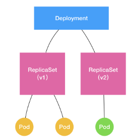
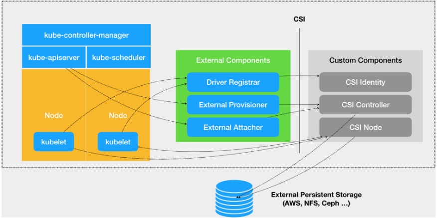
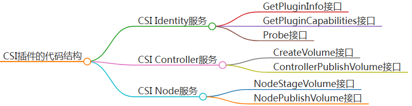

- [1. 为什么使用Docker —— 对比传统虚拟机](#1-为什么使用docker--对比传统虚拟机)
- [2. Image 镜像](#2-image-镜像)
  - [2.1. 分层存储](#21-分层存储)
  - [2.2. Dockerfile](#22-dockerfile)
    - [2.2.1. 镜像构建上下文（Context）](#221-镜像构建上下文context)
    - [2.2.2. **FROM** 指定基础镜像](#222-from-指定基础镜像)
    - [2.2.3. **RUN** 运行命令](#223-run-运行命令)
    - [2.2.4. **COPY / ADD** 复制文件](#224-copy--add-复制文件)
    - [2.2.5. **CMD** 容器主进程的启动命令](#225-cmd-容器主进程的启动命令)
    - [2.2.6. **ENTRYPOINT** CMD接收器](#226-entrypoint-cmd接收器)
    - [2.2.7. **ENV** 环境变量](#227-env-环境变量)
    - [2.2.8. **ARG** 构建变量](#228-arg-构建变量)
    - [2.2.9. **VOLUME** 定义匿名卷](#229-volume-定义匿名卷)
    - [2.2.10. **EXPOSE** 声明端口](#2210-expose-声明端口)
    - [2.2.11. **WORKDIR** 切换构建工作目录](#2211-workdir-切换构建工作目录)
    - [2.2.12. **USER** 切换用户](#2212-user-切换用户)
    - [2.2.13. **HEALTHCHECK** 健康检查](#2213-healthcheck-健康检查)
    - [2.2.14. **ONBUILD** 二次构建的命令](#2214-onbuild-二次构建的命令)
    - [2.2.15. **LABEL** 添加镜像元数据](#2215-label-添加镜像元数据)
    - [2.2.16. **SHELL** 切换指令SHELL](#2216-shell-切换指令shell)
- [3. Container 容器](#3-container-容器)
  - [3.1. 新建并启动](#31-新建并启动)
  - [3.2. 启动或停止已有容器](#32-启动或停止已有容器)
  - [3.3. 查看守护态容器内主进程的输出](#33-查看守护态容器内主进程的输出)
  - [3.4. 进入容器](#34-进入容器)
  - [3.5. 导入/导出容器](#35-导入导出容器)
  - [3.6. 删除容器](#36-删除容器)
- [4. 数据管理](#4-数据管理)
  - [4.1. 数据卷（Volumes）](#41-数据卷volumes)
  - [4.2. 挂载 Host 目录 (Bind mounts)](#42-挂载-host-目录-bind-mounts)
- [5. Docker 网络](#5-docker-网络)
  - [5.1. 外部访问](#51-外部访问)
  - [5.2. 容器互联](#52-容器互联)
  - [5.3. 容器hostname, DNS](#53-容器hostname-dns)
    - [5.3.1. 修改方式](#531-修改方式)
- [容器实现原理 —— 本质是一种特殊的进程](#容器实现原理--本质是一种特殊的进程)
  - [隔离 —— namespace](#隔离--namespace)
  - [特殊的namespace —— Mount Namespace（rootfs）](#特殊的namespace--mount-namespacerootfs)
  - [限制 —— Cgroups（Linux Control Group）](#限制--cgroupslinux-control-group)
    - [作用](#作用)
    - [使用实例](#使用实例)
  - [namespace 和 Cgroups 的不足](#namespace-和-cgroups-的不足)
    - [单进程模型](#单进程模型)
- [K8S Api 对象](#k8s-api-对象)
  - [Pod](#pod)
    - [实现原理](#实现原理)
    - [容器设计模式](#容器设计模式)
    - [yaml](#yaml)
      - [实例](#实例)
      - [· initContainers](#-initcontainers)
    - [Projected Volume](#projected-volume)
      - [secret](#secret)
      - [ConfigMap](#configmap)
      - [downwardAPI](#downwardapi)
      - [Service Account Token](#service-account-token)
    - [容器健康检查和恢复机制](#容器健康检查和恢复机制)
      - [livenessProbe 健康检查](#livenessprobe-健康检查)
  - [Deployment -- 实现作业副本、水平扩展](#deployment----实现作业副本水平扩展)
    - [example](#example)
    - [replicaSet 版本控制](#replicaset-版本控制)
    - [滚动更新实现原理](#滚动更新实现原理)
    - [CMD](#cmd)
  - [StatefulSet](#statefulset)
    - [有状态应用及实现原理](#有状态应用及实现原理)
    - [拓扑状态——Headless Service](#拓扑状态headless-service)
    - [存储状态——Persistent Volume Claim（PVC）](#存储状态persistent-volume-claimpvc)
    - [MySQL 主从集群实践](#mysql-主从集群实践)
    - [StatefulSet的滚动更新](#statefulset的滚动更新)
    - [DeamonSet -- 容器守护进程](#deamonset----容器守护进程)
      - [工作原理](#工作原理)
    - [ControllerRevision -- 滚动更新记录](#controllerrevision----滚动更新记录)
    - [Job / CronJob —— 处理Batch Job](#job--cronjob--处理batch-job)
      - [Job](#job)
      - [Cronjob](#cronjob)
    - [声明式API](#声明式api)
- [K8S 存储](#k8s-存储)
  - [PV、PVC、StorageClass](#pvpvcstorageclass)
  - [Provision](#provision)
  - [PV 挂载进容器 —— 两阶段处理（Attach、Mount）](#pv-挂载进容器--两阶段处理attachmount)
    - [Attach( Dettach )](#attach-dettach-)
    - [Mount( Unmount )](#mount-unmount-)
  - [CSI 通用存储接口](#csi-通用存储接口)
    - [流程](#流程)
    - [实现](#实现)


# 1. 为什么使用Docker —— 对比传统虚拟机
以下是Docker容器与传统虚拟机的主要特性对比：
| 特性       | 容器               | 虚拟机     |
| ---------- | ------------------ | ---------- |
| 启动       | 秒级               | 分钟级     |
| 硬盘使用   | 一般为 MB          | 一般为 GB  |
| 性能       | 接近原生           | 弱于       |
| 系统支持量 | 单机支持上千个容器 | 一般几十个 |

使用Docker容器的优势在于快速启动、硬盘占用小、性能接近原生，以及能够在单机上支持更多的系统实例。

# 2. Image 镜像
$\underline{镜像}$，基于宿主的内核，包含一套特殊的root文件系统，以及一些为运行时准备的一些配置参数（如匿名卷、环境变量、用户等）。
镜像不包含任何动态数据，其内容在构建之后也不会被改变。


## 2.1. 分层存储
镜像区别于ISO（等同于打包文件），是基于Union FS的多层文件系统联合构成。每层初始基于上一层，当前层的修改不会影响上一层。


---
## 2.2. Dockerfile

### 2.2.1. 镜像构建上下文（Context）   
```
docker build [选项] <上下文路径/URL/->
eg: 
docker build -t nginx:v3 .
```
将上下文路径下的文件打包发送到服务端，进行docker build。当不使用 `-f dockerfile` 指定 dockerfile时，默认选择Context下名为`Dockerfile`的文件。

后续 COPY, ADD 类的src都是**基于Context的相对路径**。

 <br>

### 2.2.2. **FROM** 指定基础镜像
```docker
FROM <Image>

eg:
FROM nginx:latest
FROM scratch // 指定空镜像
```

 <br>

### 2.2.3. **RUN** 运行命令
```docker
# 格式
RUN <命令>
RUN ["可执行文件", "参数1", "参数2"]

eg:
RUN set -x; buildDeps='gcc libc6-dev make wget' \
    && apt-get update \
    && apt-get install -y $buildDeps \
    && wget -O redis.tar.gz "http://download.redis.io/releases/redis-5.0.3.tar.gz" \
    && mkdir -p /usr/src/redis \
    && tar -xzf redis.tar.gz -C /usr/src/redis --strip-components=1 \
    && make -C /usr/src/redis \
    && make -C /usr/src/redis install \
    && rm -rf /var/lib/apt/lists/* \
    && rm redis.tar.gz \
    && rm -r /usr/src/redis \
    && apt-get purge -y --auto-remove $buildDeps
```
基于 UNION FS，每一个 RUN 会生成一层Docker Layer，上限127层。

为避免**镜像臃肿**，dockerfile 乃至每一个 RUN 结尾都应该清楚构建残余。

 <br>

### 2.2.4. **COPY / ADD** 复制文件
```docker
# 格式
COPY [--chown=<user>:<group>] <源路径>... <目标路径>
COPY [--chown=<user>:<group>] ["<源路径1>",... "<目标路径>"]

eg:
COPY ./package.json /usr/src/app/
COPY a* d?.txt  /mydir/
```
- **目标路径不存在**会创建。
- 源路径是基于Context的相对路径，目标路径是Docker server的绝对路径。
- 源文件的各种元数据都会保留。比如读、写、执行权限、文件变更时间等。

```docker
# 格式
ADD [--chown=<user>:<group>] <源路径>... <目标路径>
ADD [--chown=<user>:<group>] ["<源路径1>",... "<目标路径>"]

eg:
ADD package.tar /usr/src/app/ # gzip, bzip2, xz
```
- 源路径支持URL、压缩包等。
- 当源路径为tar包时，会自动解压。

**应尽量使用COPY，除非需要解压文件。**

 <br>

### 2.2.5. **CMD** 容器主进程的启动命令
```docker
# 格式
CMD <命令>
CMD ["可执行文件", "参数1", "参数2"...]

eg:
CMD echo $HOME 
# 等价于
CMD [ "sh", "-c", "echo $HOME" ]

# 运行时覆盖默认 CMD
docker run -it ubuntu cat /etc/os-release
```
- 应当指定 Frontend 形式的指令。
- 可以使用 shell 环境变量。

 <br>

### 2.2.6. **ENTRYPOINT** CMD接收器
```docker
# 格式
ENTRYPOINT <命令>
ENTRYPOINT ["可执行文件", "参数1", "参数2"...]

eg:
ENTRYPOINT ["echo"]
CMD ["-n", "Default print out"]

# 运行时动态指定
docker run -it ubuntu --entrypoint echo ""
```
- 当指定了 ENTRYPOINT 后，CMD 的含义就变成将 CMD 的内容作为参数传给 ENTRYPOINT 指令。<br>
  `<ENTRYPOINT> "<CMD>"`

 <br>

### 2.2.7. **ENV** 环境变量
```docker
# 格式
ENV <key> <value>
ENV <key1>=<value1> <key2>=<value2>...

eg:
ENV NODE_VERSION 7.2.0

RUN curl -SLO "https://nodejs.org/dist/v$NODE_VERSION/node-v$NODE_VERSION-linux-x64.tar.xz" \
  && curl -SLO "https://nodejs.org/dist/v$NODE_VERSION/SHASUMS256.txt.asc" \
  && gpg --batch --decrypt --output SHASUMS256.txt SHASUMS256.txt.asc \
  && grep " node-v$NODE_VERSION-linux-x64.tar.xz\$" SHASUMS256.txt | sha256sum -c - \
  && tar -xJf "node-v$NODE_VERSION-linux-x64.tar.xz" -C /usr/local --strip-components=1 \
  && rm "node-v$NODE_VERSION-linux-x64.tar.xz" SHASUMS256.txt.asc SHASUMS256.txt \
  && ln -s /usr/local/bin/node /usr/local/bin/nodejs
```
- 以下变量支持变量展开：`ADD`, `COPY`, `ENV`, `EXPOSE`, `FROM`, `LABEL`, `USER`, `WORKDIR`, `VOLUME`, `STOPSIGNAL`, `ONBUILD`, `RUN`

 <br>

### 2.2.8. **ARG** 构建变量
```docker
# 格式
ARG <key1>=<value1> <key2>=<value2>...

eg:
# build 时动态指定
docker build --build-arg <参数名>=<值>

eg:
# FROM 前的 ARG 只作用于 FROM
ARG DOCKER_USERNAME=library
FROM ${DOCKER_USERNAME}/alpine

RUN set -x ; echo ${DOCKER_USERNAME}    # NUL

# 要想在 FROM 之后使用，必须再次指定
ARG DOCKER_USERNAME=library
RUN set -x ; echo ${DOCKER_USERNAME}
```
- ARG 所设置的构建环境的环境变量**不会**存在于容器运行时。

 <br>

### 2.2.9. **VOLUME** 定义匿名卷
```docker
# 格式
VOLUME ["<路径1>", "<路径2>"...]
VOLUME <路径>

eg:
VOLUME /data
```
- 卷内数据变化不会保存在容器运行的存储层，保证了容器存储层的无状态化。
- `docker run -d -v myLocalData:/data xxxx` 挂载卷会覆盖匿名卷，此时数据可以持久化到 host 环境（local）。

 <br>

### 2.2.10. **EXPOSE** 声明端口
```docker
# 格式
EXPOSE <端口1> [<端口2>...]

eg:
    EXPOSE 3333 3334
```
- EXPOSE 是一种文档化的做法，用于声明容器意图打开哪些端口，但不会导致端口映射。
- docker run -p 手动指定容器端口到宿主机端口的映射。
- docker run -P 自动将所有 EXPOSE 的端口映射到宿主机的随机端口。

 <br>

### 2.2.11. **WORKDIR** 切换构建工作目录
```docker
# 格式
WORKDIR <工作目录绝对/相对路径>

eg:
    # 如操作 /app/config
    RUN cd /app
    RUN echo "Somthing" > ./config      # 错误，每层独立，cd 将无效

    WORKDIR /app
    RUN echo "Somthing" > ./config      # 正确
```
- 如不存在，则创建。
- 此后的各层当前目录就改为指定目录。

 <br>

### 2.2.12. **USER** 切换用户
```docker
# 格式
USER <用户名>[:<用户组>]

eg:
RUN groupadd -r redis && useradd -r -g redis redis
USER redis
RUN [ "redis-server" ]
```
- 只能切换存在的用户。

 <br>

### 2.2.13. **HEALTHCHECK** 健康检查
```docker
# 格式
HEALTHCHECK NONE：屏蔽默认健康检查指令
HEALTHCHECK [选项] CMD <命令>：设置检查容器健康状况的命令

# 参数
--interval=<间隔>：两次健康检查的间隔，默认为 30 秒；
--timeout=<时长>：健康检查命令运行超时时间，如果超过这个时间，本次健康检查就被视为失败，默认 30 秒；
--retries=<次数>：当连续失败指定次数后，则将容器状态视为 unhealthy，默认 3 次

eg:
HEALTHCHECK --interval=5s --timeout=3s \
  CMD curl -fs http://localhost/ || exit 1
```
- 解决主进程假死，但容器状态显示正常的场景。
- 命令的返回值决定了该次健康检查的成功与否：<br>0：成功<br>1：失败<br>2：保留，不要使用这个值。

 <br>

### 2.2.14. **ONBUILD** 二次构建的命令
```docker
# 格式
ONBUILD <其它指令>

eg:
# dockerfile -- node1
    FROM node1

    RUN mkdir /app
    WORKDIR /app

    # 构建 node1 时不会执行
    ONBUILD COPY ./package.json /app
    ONBUILD RUN [ "npm", "install" ]
    ONBUILD COPY . /app/

    CMD [ "npm", "start" ]

# dockerfile -- node2
    FROM node1
    # 执行 node1 的 ONBUILD 命令
```
- 用于制作基础镜像时，指定后续镜像的标准步骤。

 <br>

### 2.2.15. **LABEL** 添加镜像元数据
```docker
# 格式
LABEL <key>=<value> <key>=<value> <key>=<value> ...

eg:
LABEL org.opencontainers.image.authors="yeasy"
LABEL org.opencontainers.image.documentation="https://yeasy.gitbooks.io"
```
- 申明镜像的作者、文档地址等。

 <br>

### 2.2.16. **SHELL** 切换指令SHELL
```docker
# 格式
SHELL ["executable", "parameters"]

eg:
SHELL ["/bin/sh", "-c"]
RUN lll ; ls

# 第二个 RUN 运行的命令会打印出每条命令并当遇到错误时退出
SHELL ["/bin/sh", "-cex"]
RUN lll ; ls

ENTRYPOINT nginx    # /bin/sh -cex "nginx"
CMD nginx           # /bin/sh -cex "nginx"
```
- 指定 RUN ENTRYPOINT CMD 指令的 shell。
- 不指定时，默认等价于 `SHELL ["/bin/sh", "-c"]`。


# 3. Container 容器
$\underline{容器}$，是独立运行的**一个或一组应用**，以及它们的**运行态环境**。

## 3.1. 新建并启动  
```docker
docker run <Image> <CMD>
eg: 
    docker run ubuntu:18.04 /bin/echo 'Hello world'
    docker run -it ubuntu:18.04 /bin/bash

# -d: 守护态运行
# -i: 保持打开 stdin
# -t: 接入伪终端（pseudo-tty）并绑定到容器的标准输入
```
当利用 docker run 来创建容器时，Docker 在后台运行的标准操作包括：

- 检查本地是否存在指定的镜像，不存在就从 registry 下载
- 利用镜像创建并启动一个容器
- 分配一个文件系统，并在只读的镜像层外面挂载一层可读写层
- 从宿主主机配置的网桥接口中桥接一个虚拟接口到容器中去
- 从地址池配置一个 ip 地址给容器
- 执行用户指定的应用程序
- 执行完毕后容器被终止

 <br>

## 3.2. 启动或停止已有容器
```docker
docker container start [OPTIONS] <CONTAINER> [CONTAINER...]
docker container stop [OPTIONS] <CONTAINER> [CONTAINER...]
```

 <br>

## 3.3. 查看守护态容器内主进程的输出
```docker
docker container logs [OPTIONS] <CONTAINER>
```

 <br>

## 3.4. 进入容器
```docker
docker attach <CONTAINER>
docker exec [OPTIONS] <CONTAINER> <CMD>

eg:
    docker attach 69d1          # exit 会终止容器
    docker exec -it 69d1        # exit 不会终止容器
```

 <br>

## 3.5. 导入/导出容器
```docker
# 导入/导出容器快照
docker export <CONTAINER> > .tar
cat .tar | docker import - <NEW IMAGE>

# 导入镜像存储
docker load

eg:
    docker export 7691a814370e > ubuntu.tar
    cat ubuntu.tar | docker import - test/ubuntu:v1.0

    docker import http://example.com/exampleimage.tgz example/imagerepo
```
- **容器快照文件**将丢弃所有的历史记录和元数据信息（即仅保存容器当时的快照状态），导入时可以重新指定标签等元数据信息。
- **镜像存储文件**将保存完整记录，体积也要更大。

 <br>

## 3.6. 删除容器
```docker
docker container rm <CONTAINER>

# 删除所有终止的容器
docker container prune
```

 <br>

# 4. 数据管理
```docker
# 查看容器挂载信息 ("Mounts" Key)
docker inspect <CONTAINER>
```

## 4.1. 数据卷（Volumes）
```docker
# 创建 Volume
docker volume create <Volume Name>
# 删除 Volume
docker volume rm <Volume Name>
# 删除所有无主 Volumes
docker volume prune


# 挂载 Volume 启动容器
docker run -d -P \
    --name web \
    # -v my-vol:/usr/share/nginx/html \
    --mount source=my-vol,target=/usr/share/nginx/html \
    nginx:alpine

# -v        <dst> [<Volume>:<dst>]
# --mount   source=<Volume>,target=<dst>[, readonly]

```
$\underline{数据卷}$是一个可供 **一个或多个** 容器使用的特殊目录：
- 可以在容器之间共享和重用
- 对 **数据卷** 的修改会立马生效，且不会影响镜像
- 默认会一直存在，即使容器被删除
- -v 不指定宿主机 source 时，会创建临时目录 `/var/lib/docker/volumes/[VOLUME_ID]/_data` 进行挂载
 
类似于 Linux 下对目录或文件进行 mount，**数据卷为空** 时，镜像中指定挂载数据卷会 **复制** 目录下的文件到数据卷中。

 <br>

## 4.2. 挂载 Host 目录 (Bind mounts)
可以使用 --mount，直接挂载一个 host 目录作为数据卷。
```docker
# -v        <Source>:<dst>
# --mount   source=<Source>,target=<dst>[, readonly]
```
 - Host 目录必须为 **绝对路径**。
 - -v 指定 Docker dst 如不存在会创建；--mount 会 **报错**。

# 5. Docker 网络
```docker
# 查看访问记录
docker logs <CONTAINER>
```


## 5.1. 外部访问
```docker
# 随机映射端口到容器（-P）
docker run -P <CONTAINER>

# 指定端口（-p）
docker run -p [Host IP:][Host Port]:<Container Port>
eg:
    # 映射到指定地址的指定端口
    docker run -d -p localhost:80:80 nginx:alpine
    # 映射所有 ip 地址
    docker run -d -p 80:80 nginx:alpine
    # 映射到指定地址的随机端口
    docker run -d -p localhost::80 nginx:alpine
    # udp 映射
    docker run -d -p localhost:80:80/udp nginx:alpine

# 查看映射情况
docker port <CONTAINER> [PORT]
```

 <br>

## 5.2. 容器互联
```docker
# 创建容器网络
docker network create -d <bridge|overlay> <Network Name>

eg:
    docker network create -d bridge my_net
    docker run -it --name container1 --network my_net ubuntu bash
    docker run -it --name container2 --network my_net ubuntu bash
    # Inside container1
    container1$: ping container2    # connected
    # Inside container2
    container2$: ping container1    # connected
```

<br>

## 5.3. 容器hostname, DNS
容器通过挂载宿主机的 resolv.conf，来与宿主机的 DNS 同步。

### 5.3.1. 修改方式
```docker
# 修改配置文件，全局改变所有容器的DNS
vim /etc/docker/daemon.json
{
  "dns" : [
    "114.114.114.114",
    "8.8.8.8"
  ]
}

# 启动容器时设置各容器的hostname、DNS
docker run ... \
    -h HOSTNAME[|--hostname=HOSTNAME] \ # 设置 hostname
    --dns=IP_ADDRESS                    # 设置 DNS
```
如果在容器启动时没有指定最后两个参数，Docker 会默认用主机上的 `/etc/resolv.conf` 来配置容器。

# 容器实现原理 —— 本质是一种特殊的进程
 1. 启用 Linux Namespace 配置；
 2. 设置指定的 Cgroups 参数；
 3. 切换进程的根目录（Change Root）。

## 隔离 —— namespace
容器的创建，等价于 Linux 系统调用
```C
# CLONE_NEWPID
int pid = clone(main_function, stack_size, CLONE_NEWPID | SIGCHLD, NULL); 
```
创建容器进程时，指定了 Mount、UTS、IPC、Network 和 User 等进程 namespace 空间，每个空间内的进程 PID 从 1 开始计数（就是容器内部看到的进程列表）。

**容器只是一种特殊的进程**，本质上并不是真正创建了一个“容器”。

<br>

## 特殊的namespace —— Mount Namespace（rootfs）
对容器进程视图的改变，一定是伴随着挂载操作（mount）才能生效。

因此容器进程启动进行 Mount Namespace 之后，需要重新挂载整个根目录“/”，文件系统才会隔离出来。

就是容器镜像包含的 **rootfs**。

<br>

## 限制 —— Cgroups（Linux Control Group）

### 作用
 - 限制一个进程组能够使用的资源上限，包括 CPU、内存、磁盘、网络带宽等等。
 - 对进程进行优先级设置、审计，以及将进程挂起和恢复等操作。

### 使用实例
```sh
# 查看 /sys/fs/cgroup 路径下的 cgroup 文件
mount -t cgroup 
# cpuset on /sys/fs/cgroup/cpuset type cgroup (rw,nosuid,nodev,noexec,relatime,cpuset)
# cpu on /sys/fs/cgroup/cpu type cgroup (rw,nosuid,nodev,noexec,relatime,cpu)
# cpuacct on /sys/fs/cgroup/cpuacct type cgroup (rw,nosuid,nodev,noexec,relatime,cpuacct)
# blkio on /sys/fs/cgroup/blkio type cgroup (rw,nosuid,nodev,noexec,relatime,blkio)
# memory on /sys/fs/cgroup/memory type cgroup (rw,nosuid,nodev,noexec,relatime,memory)

# === 给某个进程限制资源使用（如限制 pid 226的 CPU）===
cd /sys/fs/cgroup/cpu

mkdir container			# 创建子系统【container】，并会自动创建其中对应的资源文件
ls container/
# cgroup.clone_children cpu.cfs_period_us cpu.rt_period_us  cpu.shares notify_on_release
# cgroup.procs      cpu.cfs_quota_us  cpu.rt_runtime_us cpu.stat  tasks

# 限制 CPU 时间片为 20000 us/100000 us (20%)
echo 20000 > /sys/fs/cgroup/cpu/container/cpu.cfs_quota_us
cat /sys/fs/cgroup/cpu/container/cpu.cfs_period_us 
# 100000

# 限制进程号 226
echo 226 > /sys/fs/cgroup/cpu/container/tasks 

top
# %Cpu0 : 20.3 us, 0.0 sy, 0.0 ni, 79.7 id, 0.0 wa, 0.0 hi, 0.0 si, 0.0 st
```
此外还支持如：
 - blkio，为​​​块​​​设​​​备​​​设​​​定​​​I/O 限​​​制，一般用于磁盘等设备；
 - cpuset，为进程分配单独的 CPU 核和对应的内存节点；
 - cpu，为进程设定 CPU 的限制。
 - memory，为进程设定内存使用的限制。
 - ... 
 
 创建容器时直接指定Cgroups：
```docker
docker run -it --cpu-period=100000 --cpu-quota=20000 ubuntu /bin/bash
```

## namespace 和 Cgroups 的不足
 - 容器是一个“单进程”模型，一个容器内无法同时运行两个不同的应用。
 - 容器查询 /proc 的系统资源时，会返回**宿主机**的 /proc。
   因为 /proc 文件系统不了解 Cgroups 限制的存在。
   解决办法：把宿主机的 `/var/lib/lxcfs/proc/*` 文件挂载到容器的 `/proc/*`
### 单进程模型
容器的“单进程模型”，指的并不是一个容器里面能运行多少个进程，而是容器的生命周期以PID1为基准。

即使进入后台执行其他的进程，但是主进程只要结束，容器就会退出，达不到进程分开管理的目的。

--- 

# K8S Api 对象
## Pod 
- K8S最小调度单位
- 解决“超亲密关系”容器组的**成组调度（gang scheduling）**：包括但不限于：互相之间会发生直接的文件交换、使用 localhost 或者 Socket  文件进行本地通信、会发生非常频繁的远程调用、需要共享某些 Linux Namespace。

### 实现原理
Pod 本质上还是一组容器，但通过Join Namespace共享同一个 Network Namespace，并且可以声明共享同一个 Volume。

为了能**不分先后地启动Pod内容器**，同时有一个基础的Namespace提供者，每个Pod都会先起一个Infra容器（Pause）。

---
### 容器设计模式
与其考虑在一个容器内跑多个应用，更应该考虑设计成一个Pod内的多个容器。
- sidecar：指的就是我们可以在一个 Pod 中，启动一个辅助容器，来完成一些独立于主进程（主容器）之外的工作

### yaml
#### 实例
```yaml
# 通过资源镜像 war起的InitContainer，将war资源包先行拷贝到 Pod app-volume，主进程 Tomcat 启动后直接在 app-volume 读取 war资源 来启动初始化。
apiVersion: v1
kind: Pod
metadata:
  name: javaweb-2
spec:
  initContainers:
  - image: geektime/sample:v2
    name: war
    command: ["cp", "/sample.war", "/app"]
    volumeMounts:
    - mountPath: /app
      name: app-volume
  containers:
  - image: geektime/tomcat:7.0
    name: tomcat
    command: ["sh","-c","/root/apache-tomcat-7.0.42-v2/bin/start.sh"]
    volumeMounts:
    - mountPath: /root/apache-tomcat-7.0.42-v2/webapps
      name: app-volume
    ports:
    - containerPort: 8080
      hostPort: 8001 
  volumes:
  - name: app-volume
    emptyDir: {}
```
#### · initContainers
 - sidecar 模式的经典实现方式。
 - 先于 Container、且按顺序启动；直到所有 InitContainer 都退出后，Container 才会启动。
```yaml
# 通过资源镜像 war起的InitContainer，将war资源包先行拷贝到 Pod app-volume，主进程 Tomcat 启动后直接在 app-volume 读取 war资源 来启动初始化。
apiVersion: v1
kind: Pod
metadata:
  name: javaweb-2
spec:
  initContainers:
  - image: geektime/sample:v2
    name: war
    command: ["cp", "/sample.war", "/app"]
    volumeMounts:
    - mountPath: /app
      name: app-volume
  containers:
  - image: geektime/tomcat:7.0
    name: tomcat
    command: ["sh","-c","/root/apache-tomcat-7.0.42-v2/bin/start.sh"]
    volumeMounts:
    - mountPath: /root/apache-tomcat-7.0.42-v2/webapps
      name: app-volume
    ports:
    - containerPort: 8080
      hostPort: 8001 
  volumes:
  - name: app-volume
    emptyDir: {}
```

### Projected Volume
Projected Volume（投射数据卷），存放容器预定义的数据的对象，可如`Volume`一般挂载到 Pod 上，让 Pod 直接访问其上的数据。

主要分为4类：
 - Secret：存放加密数据，如集群数据库Credentials。
 - ConfigMap：与secret几乎相同，存放不需要加密的数据。
 - Downward API：让 Pod 里的容器能够直接获取到这个 Pod API 对象本身的信息。
 - ServiceAccountToken： Kubernetes 系统内置的一种“服务账户”，它是 Kubernetes 进行权限分配的对象。

#### secret
```yaml
# 通过k8s创建
$ kubectl create secret generic user --from-file=./username.txt
$ kubectl create secret generic pass --from-file=./password.txt

# 通过yaml创建
apiVersion: v1
kind: Secret
metadata:
  name: mysecret
type: Opaque
data:
  user: YWRtaW4=
  pass: MWYyZDFlMmU2N2Rm # Base64 Encoded
```
```yaml
spec:
  containers:
  - name: test-secret-volume
    // ...
    volumeMounts:
    - name: mysql-cred
      mountPath: "/projected-volume"
      readOnly: true
  volumes:
  - name: mysql-cred
    projected:
      sources:
      - secret:
          name: user
      - secret:
          name: pass
```

#### ConfigMap
```yaml
apiVersion: v1
data:
  ui.properties: |
    color.good=purple
    color.bad=yellow
    allow.textmode=true
    how.nice.to.look=fairlyNice
kind: ConfigMap
metadata:
  name: ui-config
```

#### downwardAPI
Downward API 能够获取到的信息，一定是 Pod 里的**容器进程启动之前**就能够确定下来的信息，而不能获取**容器运行后**才会出现的信息，比如：容器进程的 PID。
```yaml
# 向上暴露该Pod的labels信息，作为labels文件挂载进pod的/etc/podinfo
spec:
  containers:
    - name: client-container
      volumeMounts:
        - name: podinfo
          mountPath: /etc/podinfo
          readOnly: false
  volumes:
    - name: podinfo
      projected:
        sources:
        - downwardAPI:
            items:
              - path: "labels"
                fieldRef:
                  fieldPath: metadata.labels 
```
```
1. 使用 fieldRef 可以声明使用:
spec.nodeName - 宿主机名字
status.hostIP - 宿主机 IP
metadata.name - Pod 的名字
metadata.namespace - Pod 的 Namespace
status.podIP - Pod 的 IP
spec.serviceAccountName - Pod 的 Service Account 的名字
metadata.uid - Pod 的 UID
metadata.labels['<KEY>'] - 指定 <KEY> 的 Label 值
metadata.annotations['<KEY>'] - 指定 <KEY> 的 Annotation 值
metadata.labels - Pod 的所有 Label
metadata.annotations - Pod 的所有 Annotation
 
2. 使用 resourceFieldRef 可以声明使用:
容器的 CPU limit
容器的 CPU request
容器的 memory limit
容器的 memory request
```

#### Service Account Token
一种特殊的`secret`，可以授权访问API Server。

容器内的应用只要加载`Service Account Token`，就可以作为k8s客户端访问上层k8s server。

每个Pod会默认挂载 ServiceAccountToken， 目录即：`/var/run/secrets/kubernetes.io/serviceaccount`
```sh
$ kubectl describe pod nginx-deployment-5c678cfb6d-lg9lw
Containers:
...
  Mounts:
    /var/run/secrets/kubernetes.io/serviceaccount from default-token-s8rbq (ro)
Volumes:
  default-token-s8rbq:
  Type:       Secret (a volume populated by a Secret)
  SecretName:  default-token-s8rbq
  Optional:    false

# 容器内查看
$ ls /var/run/secrets/kubernetes.io/serviceaccount 
ca.crt  namespace  token
```

Kubernetes 客户端以容器的方式运行在集群里，然后使用 `default Service Account` 自动授权的方式，被称作`“InClusterConfig”`。

---
### 容器健康检查和恢复机制
#### livenessProbe 健康检查
通过检查`livenessProbe`定义的容器健康返回值，来决定**容器**当前是否处于健康状态。
```yaml
# 通过检查 /tmp/healthy 是否存在，来确定容器是否健康
spec:
  containers:
  - name: liveness
    image: busybox
    args:
    - /bin/sh
    - -c
    - touch /tmp/healthy; sleep 30; rm -rf /tmp/healthy; sleep 600
    livenessProbe:
      exec:
        command:
        - cat
        - /tmp/healthy
      initialDelaySeconds: 5 # 容器启动5s后开始
      periodSeconds: 5       # 每隔5s执行一次
```
---

## Deployment -- 实现作业副本、水平扩展
### example
```yaml
apiVersion: apps/v1
kind: Deployment
metadata:
  name: nginx-deployment
  labels:
    app: nginx
spec:
  # 创建 3个 pod 副本的 ReplicaSet
  replicas: 3
  selector:
    matchLabels:
      app: nginx
  template:
    metadata:
      labels:
        app: nginx
    spec:
      containers:
      - name: nginx
        image: nginx:1.7.9
        ports:
        - containerPort: 80
```

---
### replicaSet 版本控制
Deployment 实际上是一个两层控制器。  
首先，它通过 ReplicaSet 的个数来描述**应用的版本**；然后，它再通过ReplicaSet 的属性（比如 replicas 的值），来保证 **Pod 的副本数量**。


___
### 滚动更新实现原理
创建一个新版本的ReplicaSet，逐个收缩旧版本的 Pod，并创建新版本的 Pod，最终完成更新。
___
### CMD
```sh
# 查看 replicaset
$ kubectl get rs
NAME                          DESIRED   CURRENT   READY   AGE
nginx-deployment-1764197365   2         2         2       24s
nginx-deployment-3167673210   0         0         0       35s
nginx-deployment-2156724341   2         2         0       7s
```
```sh
# 回滚到上一版本的 ReplicaSet
$ kubectl rollout undo deployment/nginx-deployment
deployment.extensions/nginx-deployment

# 查看 deployment 所有版本
$ kubectl rollout history deployment/nginx-deployment
deployments "nginx-deployment"
REVISION    CHANGE-CAUSE
1           kubectl create -f nginx-deployment.yaml --record
2           kubectl edit deployment/nginx-deployment
3           kubectl set image deployment/nginx-deployment nginx=nginx:1.91

# 查看指定版本的 API 细节
$ kubectl rollout history deployment/nginx-deployment --revision=2

# 回滚到指定版本
$ kubectl rollout undo deployment/nginx-deployment --to-revision=2
deployment.extensions/nginx-deployment

# ==================================================
# 暂停更新，以便多次修改 deployment
$ kubectl rollout pause deployment/nginx-deployment
deployment.extensions/nginx-deployment paused

# do something...

# 继续更新
$ kubectl rollout resume deploy/nginx-deployment
deployment.extensions/nginx-deployment resumed
# ==================================================

```

## StatefulSet
### 有状态应用及实现原理
 - **拓扑状态**：实例之间存在**主次**关系，如主备。
 - **存储状态**：实例之间绑定不同存储数据，如**主节点ID，备节点ID**

StatefulSet 的核心功能，就是将网络、部署逻辑与 Pod Name（hostname）绑定，维护以上状态信息。

StatefulSet 和 ReplicaSet 管理的对象都是 Pod，但是前者的 Pod 之间不再是**对等关系**。Pod 的标识信息具有了意义：  
 - 通过 Headless Service，使每个 Pod 具有了一个 PodName 相关的 DNS 名称，从而固定了**拓扑状态**。
 - 通过 PVC，使每个 Pod 具有了一个与 PodName 相关的 PVC，从而固定了**存储状态**。
___
### 拓扑状态——Headless Service
访问 Service 有两种方式:
 - IP 访问：Service VIP，流量会代理到任一个Pod。
 - DNS：访问：
   - Normal Service：指定clusterIP。  
   `my-svc.my-namespace.svc.cluster.local` => Service VIP => 转发到代理的某一个 Pod。
   - Headless Service：不绑定clusterIP。  
    `my-svc.my-namespace.svc.cluster.local` => 代理的某一个 Pod。
```yaml
apiVersion: v1
kind: Service
metadata:
  name: nginx
  labels:
    app: nginx
spec:
  ports:
  - port: 80
    name: web
  # 不指定clusterIP，创建Headless Service
  clusterIP: None
  selector:
    app: nginx
```
Headless Service 为 Pod 绑定DNS名称`<pod>.<service>.<namespace>.svc.cluster.local`，通过指定pod名称，可以直接访问对应的pod。

StatefulSet 通过指定 HeadLess Service，就可以为 Pod Name 指定拓扑身份信息。
___
### 存储状态——Persistent Volume Claim（PVC）
PVC 和 PV 类似【接口】和【实现】的关系。

StatefulSet 可以声明绑定 PVC Template，而不是具体的Volume。此时会为每个 Pod 创建一个 PVC，并以 Pod Name 标记。

当 Pod 发生变化（如删除某个Pod），PVC 和 PV **不会发生变化**。当该 Pod 恢复时，会重新分配此前 Pod Name 对应的 PVC，进而固定了存储状态与 Pod 的关系。

### MySQL 主从集群实践
使用2个initContainers和2个主Containers：  
initContainers:
 - init-mysql：解析当前 Pod 编号，生成含 `service-id` 的 `my.cnf` 文件，存放在 Volume 中。
 - clone-mysql：解析当前 Pod 编号，当不存在 backup 数据且当前节点不是主节点时，请求前一个 Pod 的3307，将 xtrabackup_backup 数据保存在 Volume。  

Containers：
 - xtrabackup：做2件事情：change master、监听其他节点访问3307.
   - 判断当前pod的mysql进程是否拉起
   - 如果拉起，且当前节点是从节点，解析 Volume 中xtrabackup数据，拼接change master命令，丢到 MySQl中运行，并start slave

 - mysql：使用volume中的my.cnf，启动mysql进程

### StatefulSet的滚动更新
修改 statefulset 的 pod 模版，就会触发滚动更新：从最后一个序号的Pod开始，逐一更新Pod。
```sh
$ kubectl patch statefulset mysql -p '{"spec":{"updateStrategy":{"type":"RollingUpdate","rollingUpdate":{"partition":2}}}}'
statefulset.apps/mysql patched
```
 - partition: 2 表示序号 >=2 的Pod才会被更新，形成**灰度发布**。
___
### DeamonSet -- 容器守护进程
1. 只在特定的节点上运行Pod：可以使用NodeSelector或者NodeAffinity来限制DaemonSet的Pod只在特定的节点上运行。
2. 根据节点的标签更新Pod：如果在集群中添加或删除了节点，Kubernetes会通过DaemonSet自动添加或删除Pod。同时，也可以通过添加或移除节点标签来更新DaemonSet中的Pod。
3. 确保每个节点只运行一个Pod：可以使用PodAntiAffinity来确保每个节点上只有一个Pod在运行。
4. 限制DaemonSet的Pod数量：可以使用MaxUnavailable和MaxSurge字段来限制DaemonSet的Pod的最大数量和最小数量。 
#### 工作原理
DaemonSet的工作原理如下：
1. 控制器监视节点的状态：DaemonSet控制器会监视集群中的节点状态，一旦有新的节点加入集群，或者节点状态发生变化（例如节点重新启动），控制器就会触发一些操作。
2. 创建/删除Pod：当控制器检测到节点拓扑发生变化（创建、删除节点）时，它会创建/删除一个该节点对应的Pod。
3. 更新Pod：如果DaemonSet的配置发生变化，例如更新了镜像版本或者修改了Pod的配置文件，控制器会自动更新每个节点上的Pod实例。
4. 扩容和缩容：DaemonSet还支持扩容和缩容，可以根据需要增加或减少Pod的数量。扩容和缩容的过程与其他控制器类似，控制器会根据指定的副本数和当前的实际Pod数量来调整Pod的数量。

### ControllerRevision -- 滚动更新记录
```yaml
# 示例 —— 对fluented的DeamonSet进行镜像更新操作后，产生的Revision=2
$ kubectl describe controllerrevision fluentd-elasticsearch-64dc6799c9 -n kube-system
Name:         fluentd-elasticsearch-64dc6799c9
Namespace:    kube-system
Labels:       controller-revision-hash=2087235575
              name=fluentd-elasticsearch
Annotations:  deprecated.daemonset.template.generation=2
              kubernetes.io/change-cause=kubectl set image ds/fluentd-elasticsearch fluentd-elasticsearch=k8s.gcr.io/fluentd-elasticsearch:v2.2.0 --record=true --namespace=kube-system
API Version:  apps/v1
Data:
  Spec:
    Template:
      $ Patch:  replace
      Metadata:
        Creation Timestamp:  <nil>
        Labels:
          Name:  fluentd-elasticsearch
      Spec:
        Containers:
          Image:              k8s.gcr.io/fluentd-elasticsearch:v2.2.0
          Image Pull Policy:  IfNotPresent
          Name:               fluentd-elasticsearch
...
Revision:                  2
Events:                    <none>
```
ControllerRevision，k8s 的通用版本控制 API 对象。
 - Data: 保存该版本API对象的完整spec信息。
 - Annotations：保存该对象的创建语句。

基于以上，k8s实现了所有对象（包括StatefulSet、DaemonSet）的更新和回滚记录。
```sh
# 回滚到上一个版本，Revision=1
$ kubectl rollout undo daemonset fluentd-elasticsearch --to-revision=1 -n kube-system
daemonset.extensions/fluentd-elasticsearch rolled back
```
___
### Job / CronJob —— 处理Batch Job
k8s 将认为作业分为2种形态：
1. LRS（Long Running Service）长作业：如Nginx、Tomcat、MySQL
2. Batch Jobs 批量/计算作业：如生成一个uuid的function。

**Batch Jobs** 的特点是**用时创建、用后销毁**，如果用DeployMent来管理pod，会使任务不断创建、不断执行。

#### Job
```yaml
# 计算圆周率5000位的简单脚本Pod
apiVersion: batch/v1
kind: Job
metadata:
  name: pi
spec:
  # 并行度：允许最多2个Job Pod同时运行
  parallelism: 2
  # 完成度：最终需要4个[Completed]的Job Pod
  completions: 4
  # Job使用Pod模版
  template:
    spec:
      containers:
      - name: pi
        image: resouer/ubuntu-bc
        command: ["sh", "-c", "echo 'scale=5000; 4*a(1)' | bc -l "]
      # Job只允许[ Never | Onfailure ]
      restartPolicy: Never
  # restart最大重试次数
  backoffLimit: 4
  # 每个Pod的超时时间，防止卡死或者不退出
  activeDeadlineSeconds: 100
```

#### Cronjob
管理 Job 的对象，类似Deployment和Pod的关系。
```yaml
apiVersion: batch/v1beta1
kind: CronJob
metadata:
  name: hello
spec:
  # Crontab 语法：每1分钟创建一个Job
  schedule: "*/1 * * * *"
  # 按时创建Job
  jobTemplate:
    spec:
      template:
        spec:
          containers:
          - name: hello
            image: busybox
            args:
            - /bin/sh
            - -c
            - date; echo Hello from the Kubernetes cluster
          restartPolicy: OnFailure
  # 是否允许并行Job [Allow | Forbid | Replace]
  concurrencyPolicy: Allow
  # miss job 环比达到100个的时间窗口
  startingDeadlineSeconds: 200
```
当 CronJob **创建 Job 失败**，在 [startingDeadlineSeconds] 窗口内达到**100**次（k8s写死）时，CronJob 会**停止**。

### 声明式API
一种编程接口风格，通过声明“是什么”而不是“怎么做”来描述程序的行为或状态。即通过声明对象的“期望”或“最终”状态，不关注具体实现和调谐机制，来获得相应对象。

与命令式API（Imperative API）相比，声明式API更关注于描述最终状态或目标，而不是具体的步骤或过程。

# K8S 存储
## PV、PVC、StorageClass
- PV（Persistent Volume）: 一个具体的 Volume 的属性，比如 Volume 的类型、挂载目录、远程存储服务器地址等。
- PVC（PV Claim）：描述想要使用的PV的属性，比如存储的大小、读写权限等，K8S 会寻找满足条件的已存在可使用 PV。
- StorageClass: **PV的模版**
  1. 指定 PV 的 Provisioner（存储插件）。若该插件支持 Dynamic Provisioning，则 PVC 声明StorageClass，就可以动态创建所需PV进行绑定。
  2. 只有同属于一个 StorageClass 的 PV 和 PVC 才可以绑定。

## Provision
- Static Provisioning：预先创建PV，然后分配给PVC。
- Dynamic Provisioning：通过StorageClass动态生成PV的方式，分配给PVC。

## PV 挂载进容器 —— 两阶段处理（Attach、Mount）
### Attach( Dettach )
- SOURCE：Master 上的 Volume Controller 维护一个控制循环 AttachDetachController
- 过程：
  1. 当 Pod 调度到某个节点时，AttachDetachController 会查看 Pod 的 Volume 目录（物理路径为 `/var/lib/kubelet/pods/<Pod 的 ID>/volumes/kubernetes.io~<Volume 类型 >/<Volume 名字 >`）
  2. 将所需 Volume 与宿主机 Attach，成为宿主机上的可用磁盘。
### Mount( Unmount )
- SOURCE：宿主机上**独立于** kubelet 主循环的另一个Goroutine `VolumeManagerReconciler`（为了将Volume的处理与主循环解耦，避免阻塞）。
- 过程：
  1. 对磁盘进行预处理：如格式化等。
  2. 将磁盘挂载到容器的指定目录。

## CSI 通用存储接口

### 流程
独立于常规 PV, PVC 的控制循环和组件，k8s 存在组件 `External Components`:
 - External Registrar
 - External Provisioner
 - External Attacher

通过调用 CSI 实现的 gRPC 服务（`Custom Components`），负责新 CSI Volume 类型的`Register、Provision、Attach`，进而复用节点上的 VolumeManagerReconciler 进行 `Mount。`

**三阶段**处理：
1. **Provision**: （新增）相当于创建卷。
2. Attach
3. Mount
___
### 实现

实现以下3个 gRPC Service：
1. CSI Identify：暴露插件的配置信息，如CSI名称等，对应 `Register`。
2. CSI Controller：封装在Master节点上进行的管理该 CSI Volume（新的PV类型）的方法，如`创建/删除、Attach/Dettach、快照`等。
   - CreateVolume：`Provision` 调用存储设备的API，创建一个对应的存储卷。
   - ControllerPublishVolume：`Attach` 调用存储设备的API，讲存储卷挂载到宿主机（如Volume挂载到虚拟机中）
3. CSI Node：封装在节点上进行的Volume操作：
   - NodeStageVolume：`MountDevice` 步骤，在宿主机中对存储卷进行格式化，并Mount到一个临时目录（Staging）上。部分存储类型如NFS不需要格式化。
   - NodePublishVolume：`SetUp` 步骤，将`MountDevice` 的 Staging 目录，挂载到容器 Volume 对应的目录上。