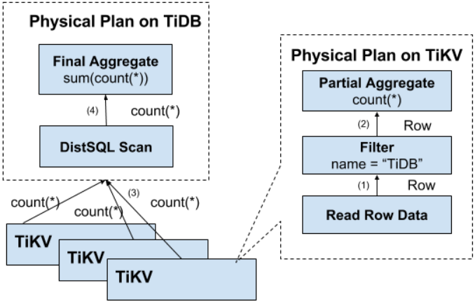

# TiDB
## 架构


### 存储--TiKV

- 形式：分布式K-V存储
- RocksDB：集成作为单机的存储引擎，等同于k-v map
  - 写入性能好
  - **有序存储：** 数据按Key排列
  - 有序 key 的迭代场景访问效率较高
- Region：`Range` 水平切分的数据分片，等同于 Partition，均匀分布在所有节点
- Region Group：一个Region的多个副本，采用`Raft`数据复制
- Region 跨节点事务：
  - MVCC：通过 `Key_Version` 方式实现
  - 2PC

### 调度 -- PD
- 需求:
  - 增加/删除 Replica
  - Leader 在 Group 内所有 Replica 间 Transfer
- 信息收集：
  - TiKV 节点（Store）会定期向 PD 汇报整体信息
  - 每个 Leader 会向 PD 汇报当前 Region 的信息
- 调度策略：
  - Region 的 Replica 数量正确
  - Region 内的 Replica 不在同一个**位置**
  - 副本在 Store 之间的分布均匀分配
  - Leader 数量在 Store 之间均匀分配
  - 热点在 Store 之间均匀分配（基于上报的读/写负载速度）
  - 各 Store 的存储空间占用大致相等

### 计算 -- TiServer
- 行映射：
```
Key: tbPrefix{tableID}_recordPrefix{rowID}
Value: [col1, col2, col3, col4]
```
- Index 映射：
```
Key: tablePrefix{tableID}_indexPrefixSep{indexID}_indexedColumnsValue
Value: rowID
```
- Unique Index 映射：
```
Key: tablePrefix{tableID}_indexPrefixSep{indexID}_indexedColumnsValue_rowID
Value: null
```
- 分布式 SQL 运算

  - MapReduce 的思想，在 KV 分别计算子结果后，在 Server 汇总

### HTAP承载 -- TiFlash
- Raft 数据复制创新：`一致性` 和 `异步复制` **共存**
- 异步复制：基于 Raft 的 `Learner`，不投票仅异步抄写
  - 不会影响 TP 端业务
- 一致性：无需提供强一致性，仅需提供**一致的逻辑读取结果**，
  - 读取校对：
    - 读取列存时，向行存请求当前最新的日志序号
    - 等待 TiFlash 追上后返回结果
    