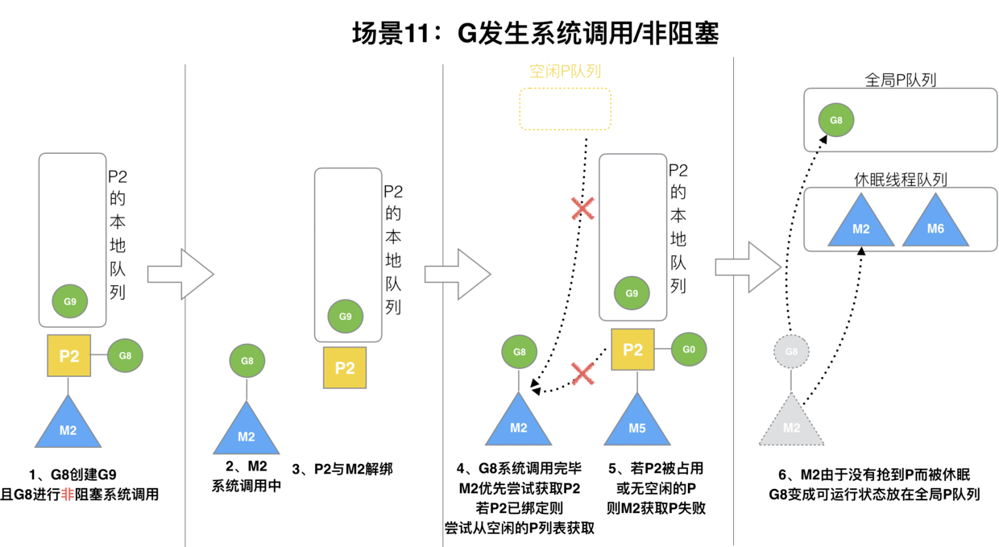

# 数组
## 定义
```golang
var a [3]int                    // 定义长度为3的int型数组, 元素全部为0
var b = [...]int{1, 2, 3}       // 定义长度为3的int型数组, 元素为 1, 2, 3
var c = [...]int{2: 3, 1: 2}    // 定义长度为3的int型数组, 元素为 0, 2, 3
var d = [...]int{1, 2, 4: 5, 6} // 定义长度为6的int型数组, 元素为 1, 2, 0, 0, 5, 6
```
- 数组是**值语义**，传递时复制整个数组
- `[0]int{}` 空数组不占用内存空间

# select
用于 case 一系列 channel 的收发状态，默认情况下会阻塞当前线程和 Goroutine

- 非阻塞收发：当包含 `default` 时，select **不会阻塞**，用于检查所有 case 中是否存在可读写的情况
```golang
select {
case err := <-errCh:
    return err
default:
    return nil
}
```

- 随机执行：当有多个 case 同时就绪，会随机执行其中一个。可以避免顺序执行时后续 case 产生饥饿问题

# defer
- 作用域：在当前函数和方法返回之前
- 倒序执行：多个 defer 按调用顺序倒序执行
- 预定义参数：defer 的传值在 defer 关键字调用时计算

# mutex
互斥锁
```golang
type Mutex struct {
    state int32
    sema  uint32
}
```


- 加锁时，如果 Locked = 1（已加锁），满足以下 **自旋条件** 情况下，协程会自选，而非马上阻塞：
  1. 自旋次数足够小，通常为4，即自旋最多4次
  2. CPU核数要大于1，否则自旋没有意义，因为此时不可能有其他协程释放锁
  3. 协程调度机制中的Process数量要大于1，比如使用GOMAXPROCS()将处理器设置为1就不能启用自旋
  4. 协程调度机制中的可运行队列必须为空，否则会延迟协程调度
  5. 当前没有协程进入饥饿（Starvation）状态
- 自选可以让当前协程有机会马上获得锁，避免了协程切换
- 当有协程被唤醒尝试加锁，但是因为有协程自旋抢先获得锁，自己被迫重新阻塞后，就会标记饥饿（Starvation）

# RWMutex
读写互斥锁
```golang
type RWMutex struct {
    w           Mutex  //用于控制多个写锁，获得写锁首先要获取该锁，如果有一个写锁在进行，那么再到来的写锁将会阻塞于此
    writerSem   uint32 //写阻塞等待的信号量，最后一个读者释放锁时会释放信号量
    readerSem   uint32 //读阻塞的协程等待的信号量，持有写锁的协程释放锁后会释放信号量
    readerCount int32  //记录读者个数
    readerWait  int32  //记录写阻塞时读者个数
}
```
## 写锁阻塞写锁
- 写锁需要获取 Mutex，已获取 Mutex 则进入阻塞

## 写锁阻塞读锁
- 写锁将 `readerCount - 2^30 (int32 最大值)`
- 读请求到来进行 `readerCount + 1`，判断负值，知道有写锁，遂阻塞等待
- 写锁释放后， `readerCount + 2^30`，此时恰好是等待释放写锁的`读协程数`

## 读锁阻塞写锁（但写防饥饿）
- 写请求发现 `readerCount != 0`，遂阻塞等待，但会将此时的 `readerWait = readerCount`，表示最多等待当前所有读请求完成，避免`写请求饥饿`
- 后续的读请求到来会：
  - 等待原始读请求完成 `readerWait = 0`
  - 进入写请求，等待写请求完成
  - 继续后续的读请求

# 协程调度 
## 进程、线程、协程
- 进程：独立的栈、堆空间，进程切换只发生于内核态
- 线程：独立的栈，进程内共享堆。上下文切换较进程更轻，但仍**需内核调度**，会发生用户态、内核态切换。
- 协程：
  - 将独立的函数（协程）多路复用到一组线程上
  - 由用户代码控制协程调度，因此协程切换仅发生在用户态，内核不感知
  - 占用内存很小，KB级别，可以创建几十万（线程是 MB）

协程的优势：
1. CPU 优势：避免内核级的频繁切换
2. 性能高：因为切换只发生在用户态，没有系统调用、时钟中断等影响
3. 节约内存：协程只占 KB（但可以伸缩）
4. 开发效率高：协程容易操作

## GMP 调度模型

Go 调度本质是把大量的 goroutine 分配到少量线程上去执行，并利用多核并行，实现更强大的并发。
- `P(Prossesor)`：运行 G 的资源实体，通常是 CPU 核心; `M(Machine)`: 工作线程; `G(Goroutine)`
- M0：初始M，用于执行第一个G，后续和普通M作用相同
- G0: 每一个M中固定存在一个G0，进行调度G任务。每当G主动或被动让渡时，M需要切换至G0调度新的G执行 `G->G0->G`
- P 的最大数目(`执行中+自选`)由 `runtime.GOMAXPROCS` 控制


- 通过 go func () 来创建一个 goroutine
- 有两个存储 G 的队列，一个是局部调度器 P 的本地队列、一个是全局 G 队列。新创建的 G 会先保存在 P 的本地队列中，如果 P 的本地队列已经满了就会保存在全局的队列中；
- G 只能运行在 M 中，一个 M 必须持有一个 P，M 与 P 是 1:1 的关系。M 会从 P 的本地队列弹出一个可执行状态的 G 来执行，如果 P 的本地队列为空，就会向其他的 MP 组合偷取一个可执行的 G 来执行；
- 一个 M 调度 G 执行的过程是一个循环机制；
- 当 M 执行某一个 G 时候如果发生了 syscall 或则其余阻塞操作，M 会阻塞，如果当前有一些 G 在执行，runtime 会把这个线程 M 从 P 中摘除 (detach)，然后再创建一个新的操作系统的线程 (如果有空闲的线程可用就复用空闲线程) 来服务于这个 P；
- 当 M 系统调用结束时候，这个 G 会尝试获取一个空闲的 P 执行，并放入到这个 P 的本地队列。如果获取不到 P，那么这个线程 M 变成休眠状态， 加入到空闲线程中，然后这个 G 会被放入全局队列中。

### 调度策略

- 本地队列：
  - 新增：新创建的Goroutine优先进入相应P的局部队列
  - 调度：每个 P 有自己的局部队列，绑定的M-P组合优先从局部队列消费G
- 全局队列：有全局锁
  - 新增：
    - 局部队列已满新G加入失败时，连同**局部队列的一半G**一起进入此列
    - 主动让渡、抢占让渡的G进入此列
  - 调度：局部队列耗尽，或者累积调度局部队列超过一定值（61次，防全局队列饥饿），调度全局队列的**一部分G**到局部队列
- 窃取：
  - 新增：局部队列和全局队列均为空，随机抽取**某一个M-P组合**的一半G

___
### 调度时机
- 主动调度：协程主动让渡自己的执行权
- 被动调度：协程休眠、通道堵塞、网络堵塞、垃圾回收导致暂停时。不会进入全局队列，而是等待唤醒后，尝试进入局部队列。
- 抢占调度：Go 有一个监控线程sysmon，对执行时间过长（10ms）的协程进行抢占
  - 发送抢占信号
  - MG 解绑，G进入全局队列
  - M继续调度新的G

___
### 系统调用

当MG执行系统调用时：
1. 与P解绑
2. P 判断：如果局部有待执行G或有空闲的M，马上绑定一个M；否则进入空闲P
3. MG系统调用结束后，尝试绑定原P或空闲P，如果都没有则G全局，M空闲

# 垃圾回收
## 标记清扫
- 全程开启 STW
- 扫描所有对象，标记其中没有再被引用的对象
- 清理对象
- 释放 STW

### 缺点
- 全程 STW，效率很差

## 三色标记法
- 将对象状态划分为三类：
  - 黑色：受保护对象，本轮GC不清理
  - 灰色：从 Root 对象可达的对象
  - 白色：不可达、无引用的对象
- 标记所有对象为白色
- 从 ROOT 对象触发，逐轮标记一层当前可达的对象，记为灰色
- 后续轮次，将当前的灰色的对象置黑，并继续扫描灰色对象