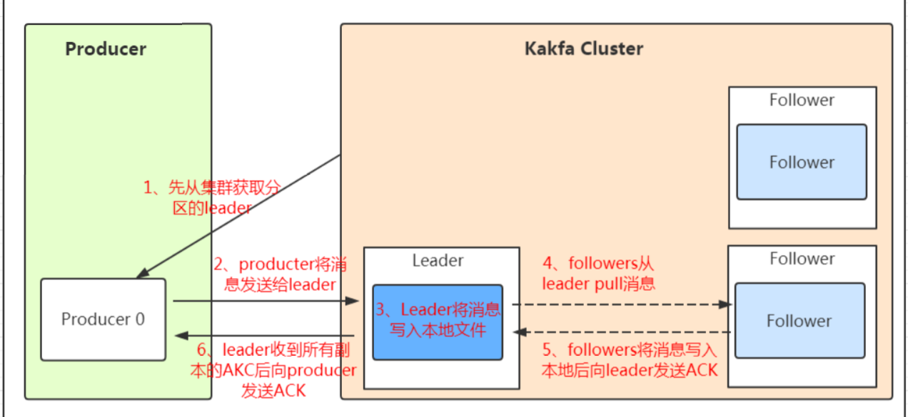
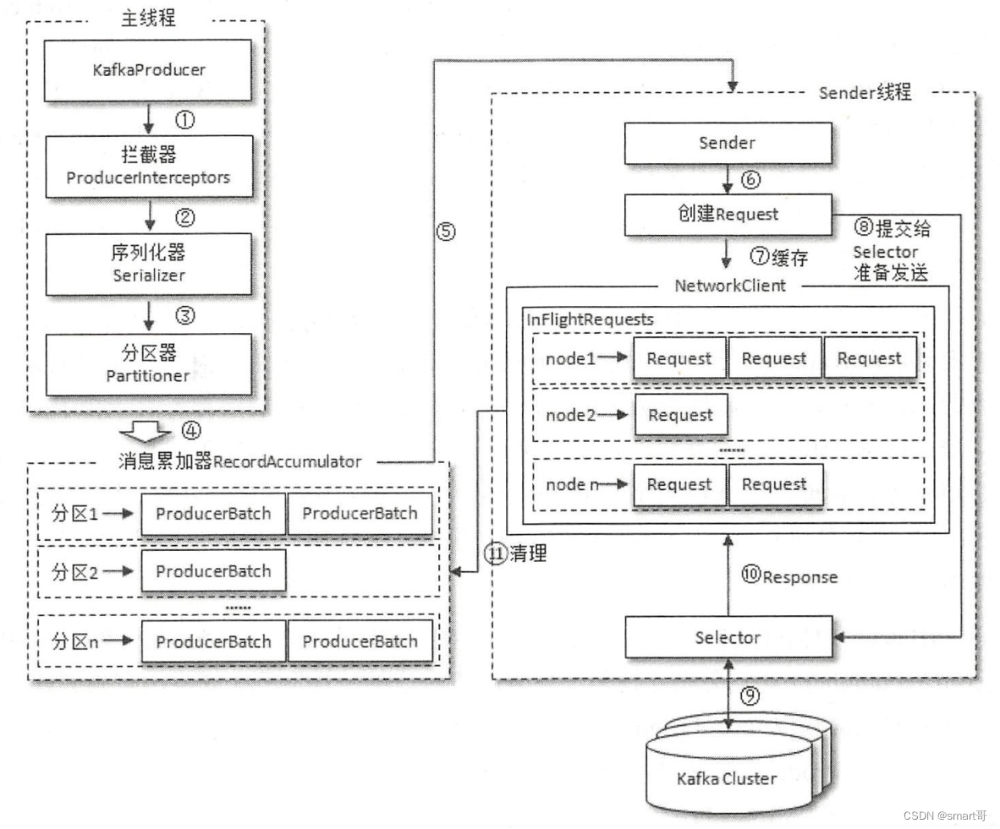
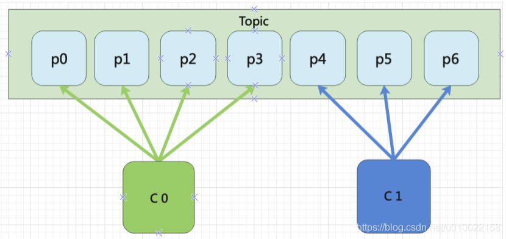
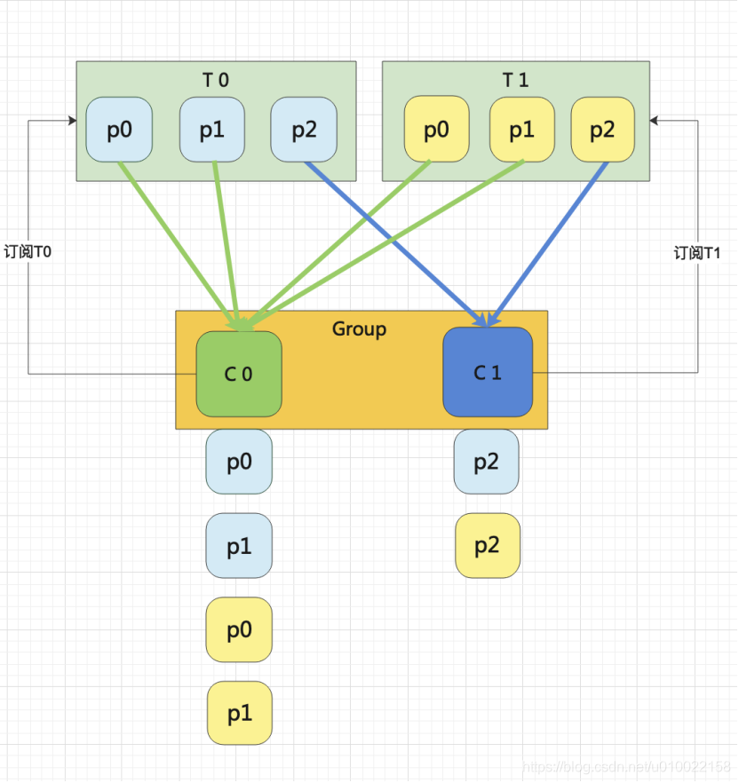
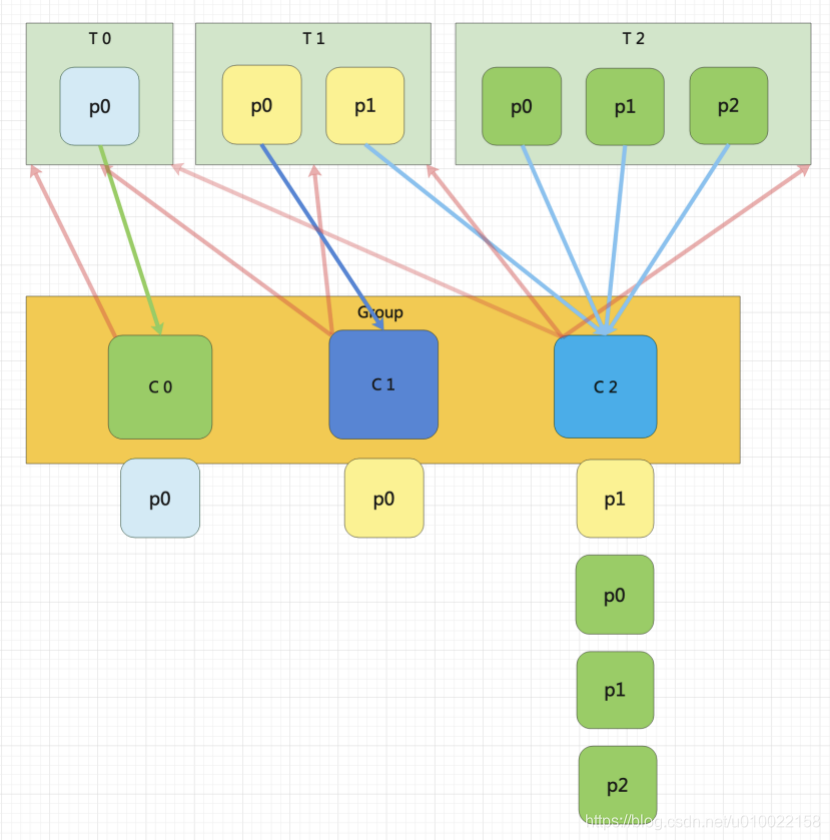
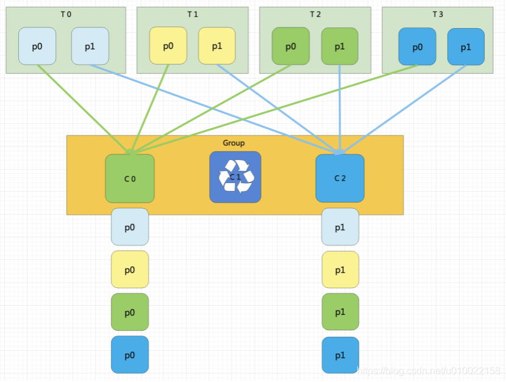
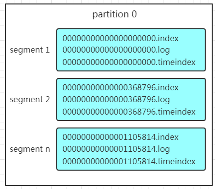
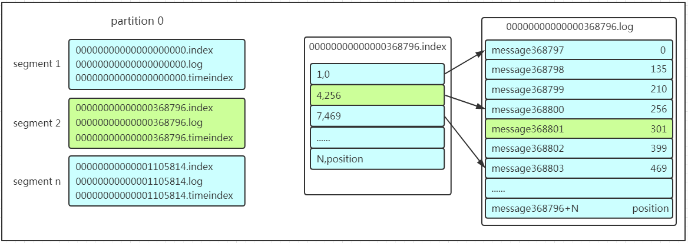
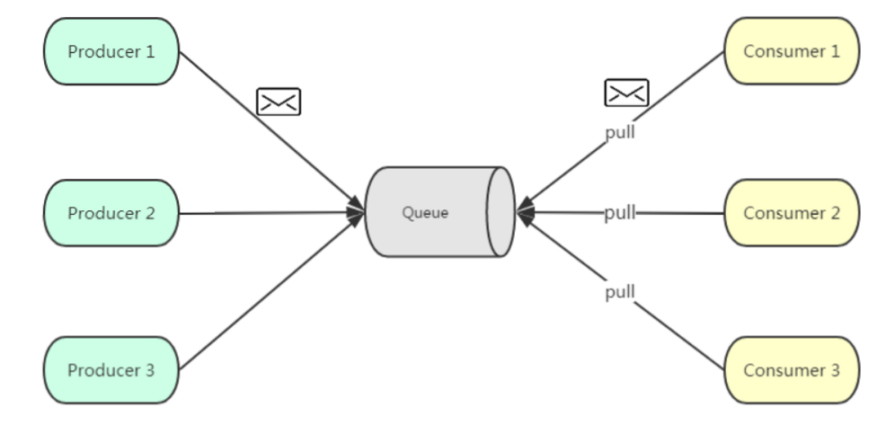
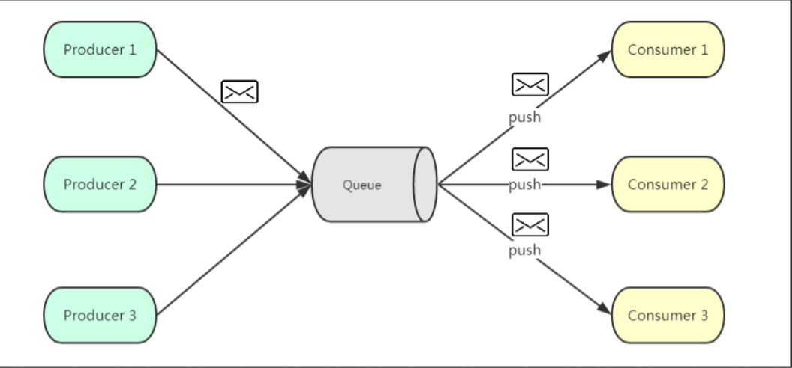

# 架构描述

- Producer：生产者，消息入口
- Broker：kafka 实例，可以有多个，可以位于不同的服务器
- Consumer：消费者，消息出口
- Consumer Group：一组消费者，可以同时消费一个 `Topic` 中的不同 `Partition`
- Topic：消息主题，每个 Broker 可以创建多个 Topic
- Partition：同一个 Topic 可以分片为多个 Partition，用于 loadBalance
- Replication：同一个 Partition 可以在多个 Broker 上存在副本，用于高可用
- Leader/Follower：Partition Replication 的主从角色，只有主副本可以提供读写
- `AR` = `ISR` + `OSR：`
  - `AR（Assigned Replica）`：一个 Partition 的所有副本
  - `ISR（In-Sync Replica）`：Leader 和保持正常同步的 Follower
  - `OSR（Out-Sync Replica）`：未同步的Follower

## 消息流程

## Producer 架构

- 分为 `主线程` 和 `Sender` 线程
- 主线程：负责消息的创建、封装
  1. **拦截器**：（如有定义）
  2. **序列化器**：转换为自定义协议格式
  3. **分区器**：按照策略，决定发往哪一个Partition
  4. 消息封装为 \<`ProducerRecord`> 对象，包含时间戳、Topic、分区信息等。
  5. **RecordAccumulator累加器**：（**异步懒提交**）双端队列发送缓冲，`buffer.memory` 控制缓存大小，将多个 `PorducerRecord` 包装 `ProducerBatch` 一并发送，**减少网络 IO 次数**。

- Sender: 负责消息实际的发送
  - 循环阻塞读取**累加器**内的消息
  - 根据消息的分区信息，发往指定的Kafka分区
  - 消息进入 `InFlightRequests`，指示每个节点已发送尚未 `ack` 的消息
  - 收到 `ack`：返回缓冲队列内删除该消息
  - 未收到 `ack`：执行重试策略

### 重试发送
- `retries`：最大重试次数
- `acks`：消息的确认级别
  - 0：不等待ack确认
  - 1：等待 Leader 确认
  - all：等待所有 partition 确认
- `至少/精确发送一次`Producer类型：
  - 幂等型：
    - `enable.idempotence=true`
    - producer 持有 PID，每个消息分配`seq_num`，broker 不会重复接受相同的信息
  - 事务型：
    - `enable.idempotence=true`
    - `生产者设置 transactional.id`
    - 跨分区事务型：确保所有分区接受消息的原子性

### 分区器、分区策略
生产者的消息应发往哪一个 Partition

- 分区策略
  - 轮询：既没有指定partition，也没有设置key
  - hash取模：设置了key，将key按哈希取模
  - 指定分区：设置了partition
  - 自定义分区器：`producer.Partitioner` Override `partition` 方法，如实现一致性hash
___
## Consumer
### 消费偏移 Offset
- 消费者维护所消费 partition 的消息消费偏移
- 根据提交策略，消费者在每次消费信息后手动/自动提交偏移量到broker，便于故障恢复后重获偏移量。
- `__consumer_offsets`: broker 存放 offset 的主题 

### 分配器，分配策略
指定哪一个 Consumer 消费哪一个 Partition
- 消费者客户端参数 `partition.assignment.strategy`:
  - Range **(默认策略)**：对每个Topic而言。
    
    - `n = partitions/consumers`
    - 场景：Topic数与消费者数尽量整除
    - **每个消费者**消费**每个 Topic** `n` 个分区
    - 除不尽时，会出现排前面的消费者负担更多  
    

  - RoundRobin：通过轮询的方式均衡分配分区
    - 场景：消费者均订阅相同的Topic
    - 条件：
      - 组内所有消费者线程数相同 `num.streams`
      - 每个消费者订阅的Topic相同
    - 若组内消费者订阅Topic相同，则轮询能保持均匀；反之（如图）不能。
    

  - Sticky
    - 场景：
      - 频繁发生重平衡（Rebalance）
      - Group 内订阅不同的 Topic
    - 保证：
      - 尽可能均匀分布
      - 发生重平衡时，分区变动尽量少
    

### 重平衡（Rebalance）
- 根据分配策略`partition.assignment.strategy`确认 Group 内成员如何消费 Partition
- 条件：
  1. Group 发生变动（增减 Consumer）
  2. 订阅的 Partition 增加
  3. 匹配新的 Topic
___
## Partition 存储结构

- Kafka 预留一片内存，在内存内**追加写入**持久化信息
- 每一个Partition = `文件夹`
- Partition 下分为多个 `segment1, segment2...`
- 每个 segment 由3部分组成：
  
  - .log：存放消息实体，包括offset、消息体等
  - .index：存放 `message offset` 到 `log 内信息物理偏移` 的稀疏索引
  - .timeIndex：（>= 0.10.0.0）按照`消息时间戳`来索引消息
___
# 消息推送模式
## 推拉模式

- 基于拉取或者轮询的消息传输模型
- **优点：**
  - 消费者自行控制信息消费速率
- **缺点：**
  - 无法通知消费者有无信息可消费，需要维护一个监听线程不断拉取

## 发布/订阅

- 基于消息推送
- 优点：
  - 消费者被动接收，不需要监听是否有待消费消息
- 缺点：
  - 推送的速度成为问题，消费者消费能力不一致，很难统一一个兼顾性能和承受能力的值。
___
