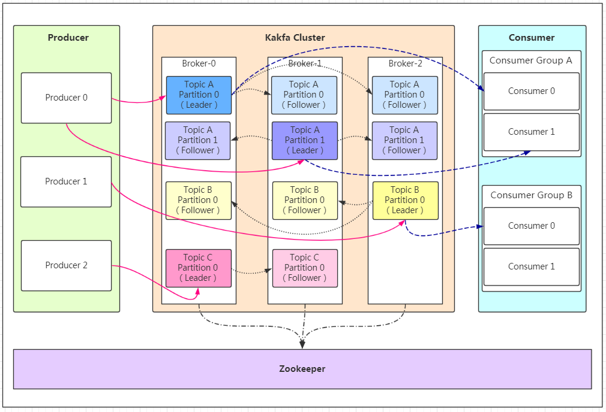

# 架构描述

- Producer：生产者，消息入口
- Broker：kafka 实例，可以有多个，可以位于不同的服务器
- Consumer：消费者，消息出口
- Consumer Group：一组消费者，可以同时消费一个 `Topic` 中的不同 `Partition`
- Topic：消息主题，每个 Broker 可以创建多个 Topic
- Partition：同一个 Topic 可以分片为多个 Partition，用于 loadBalance
- Replication：同一个 Partition 可以在多个 Broker 上存在副本，用于高可用
- Leader/Follower：Partition Replication 的主从角色，只有主副本可以提供读写