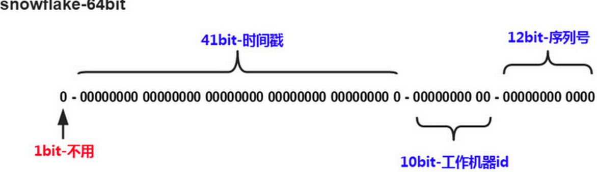
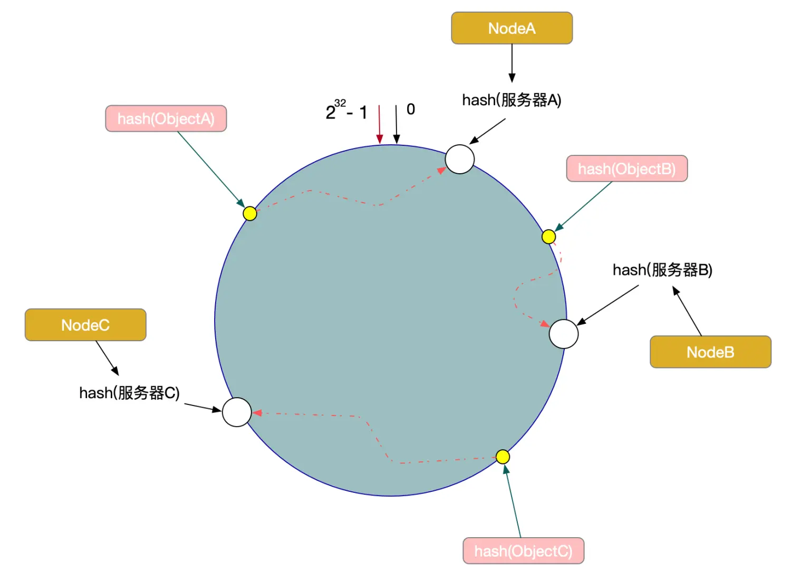

# Kafka
- 如何提升 Producer 的性能？
- 零拷贝是怎么实现

# Redis
## 缓存穿透相关
- 击穿：热点 key 突然失效
	- 解决：1、设置热 key 永不过期；2、熔断保护数据库

- 雪崩：大部分 key 同时失效
	- 原因：1、Redis 宕机；2、key 批量设置了相同的过期时间
	- 解决：1、随机过期时间；2、熔断保护数据库；3、加强 Redis 可用性，如集群

- 穿透：大量请求查询不存在的数据
	- 原因：1、无意或恶意的错误请求
	- 解决：1、前置拦截：缓存空 value；增加布隆过滤器拦截不存在key；2、熔断保护数据库；
	
# Golang
- Golang 的 GC 触发时机是什么？
	- 主动：runtime.GC
	- 周期：默认2分钟
	- 阈值：默认内存扩大一倍的时候触发一次gc

- Map 原理 rehash 怎么回事
- sync.Map 原理
- 内存泄漏 以及修复方式
- 逃逸分析

# 数据库
- 介绍下 binlog
- SQL 执行过程：
	1. 连接池（Connection Pool）：客户端连接
	2. 查询缓存（Query Cache）（ < MySQL8.0 ）：K-V 缓存
	3. 服务层：
		- 解析器（Parser）：词法分析，生成抽象语法树 AST
		- 优化器（Optimizer）：根据 AST，选择生成查询计划
		- 执行器（Executor）：调用存储引擎 API，执行计划，返回结果

- QC查询缓存为什么 8.0 移除
  - 锁竞争：QC 引入高并发场景下的锁竞争性能问题。
  - 效率低：为维护 QC 缓存一致性，相关数据进行修改后，缓存数据会全部失效。
  - 读瓶颈的场景下可以使用外置缓存，如 Redis 等。
  
# 分库分表
  - 垂直拆分：按业务聚合系统或者宽表中的列：
    - 垂直分库：如订单系统、支付系统；垂直分表
  - 水平拆分：
    - 水平分表，水平分库
- 分库分表的数据量阈值
  - 通常是千万级，此时 `B+树深度`大概率到4层，影响总体的查询效率。
- Join 查询？
  - 字段冗余：
    - 字段较少、数据较少的场景。
    - 将要 Join 的字段额外存一列在本表中。
  - 全局表冗余：
    - 要 Join 的基础表比较集中，数据量较少。
    - 公共使用的基础表，在每个库中都维护一份。
  - ETL 同步：
    - 定时执行的报表服务等。
    - 使用 ETL 工具，将需要聚合的表汇总在一个新表上。
  - 应用层组装：
    - 灵活
    - 应用层多次查询不同服务的数据，代码上做汇总处理。
- 全局ID 雪花算法--分布式自增ID
  
  - 生成64位的Long型数字，组成部分：
    - 1 -- 未使用
  	- 41 -- 毫秒级时间，41位的长度可以表示69年的时间
	- 10 -- workerId。10位的长度最多支持部署1024个节点
	- 12 -- 计数，12位的计数顺序号支持每个节点每毫秒产生4096个ID序列
- 分片策略
  - Hash 取模：`hash（id）% counts(servers)`
    - 优点：简单
    - 缺点：
      1. 服务器扩容会失效大量数据（**哈希算法的单调性问题**）
      2. 非分表键查询时，无法定位分片库。
  - **一致性hash**：对 `2^32 取模`，数据和server分布在 `2^32-1` 长度的哈希环
  
    - 哈希算法的`单调性`：缓冲区的增减，不会导致原有数据的大规模重定位。
    - **问题**：
      - 数据倾斜：server 较少时，环上数据可能非均匀地集中在某几个server，导致数据倾斜。
        - 解决方法：虚拟节点：实际节点在 hash 空间的多个复制品（replica），如 `IP 拼接序号: hash(ip1#1), hash(ip1#2)`
      - 服务血崩：大流量导致某个节点挂掉，流量会顺时针找到下一个节点，可能引发连环宕机。
        - 解决方法：增加限流和熔断
    - 优雅扩缩容：类似 Redis dictht，保存新旧两份 hash ring，扩容过程：`查新ring => 查旧ring => 未命中穿透缓存或者命中更新新ring`
  - HashSlot & P2P（Redis Cluster）
    - 对比 hash ring：
      1. `一致性哈希` 需要引入负载均衡；`RedisCluster`**去中心化**，通过Gossip协议维护Slot表和 `MOVED错误`内部转发

# K8s
- Kubernetes部署Pod的流程
- scheduler如何感知有新的Pod
- Docker 怎么实现文件系统的隔离？

# 网络
- 讲讲HTTP的短连接和长连接？
- HTTP长连接如何识别服务器响应是哪次请求的回复？
- 长连接客户端如何判断服务器已返回所有响应？

# 存储
- CPU读写磁盘的方法？相比CPU直接读写，DMA让CPU少了什么操作？

# 场景
- 延时队列：
  - Redis：Zset，score为到期时间，越接近score越小，排序越前
  - Kafka：**时间轮** `SystemTimer`

- Go实现tryLock，加锁失败返回false，加锁成功返回true（用CAS实现）
- 日志海量收集

- 实现带时间先后的排行榜
	- Zset，score = `分数.f(时间戳)` = `分数 + (1 - 时间戳 / 1^13)`
  
- 实现多维度排行榜
	- Zset，score 按照类雪花算法分段生成如：800010001 => 8000（分数）100（等级）01（性别）

# 操作系统
- 内存管理
- 进程管理 
- 文件系统

# 微服务框架
面向对象进阶
战略层面：
## Kratos
### DDD 领域驱动
战略层面：
  - 领域、子域、通用语言、限界上下文... -> **分治**：指导软件模块划分
战术：
  - 聚合对象高内聚
  - 依赖倒置
