- [Redis 数据结构](#redis-数据结构)
  - [SDS (Simple Dynamic String)](#sds-simple-dynamic-string)
    - [概要](#概要)
    - [预分配](#预分配)
    - [惰性空间释放](#惰性空间释放)
  - [链表](#链表)
    - [涉及的 Redis 类型](#涉及的-redis-类型)
    - [数据结构](#数据结构)
    - [总结](#总结)
  - [字典](#字典)
    - [涉及类型](#涉及类型)
    - [数据结构](#数据结构-1)
      - [dict, dictType](#dict-dicttype)
      - [dictht, dictEntry](#dictht-dictentry)
    - [哈希算法](#哈希算法)
    - [扩展与收缩](#扩展与收缩)
    - [rehash](#rehash)
  - [跳表](#跳表)
    - [涉及类型](#涉及类型-1)
    - [数据结构](#数据结构-2)
  - [intset](#intset)
    - [涉及类型](#涉及类型-2)
    - [数据结构](#数据结构-3)
    - [encoding 升级](#encoding-升级)
  - [ziplist 压缩列表](#ziplist-压缩列表)
    - [涉及类型](#涉及类型-3)
    - [数据结构](#数据结构-4)
    - [prev\_entry\_length 导致连锁更新](#prev_entry_length-导致连锁更新)
    - [prev\_entry\_length 实现zls反向遍历](#prev_entry_length-实现zls反向遍历)
  - [redisObject 对象](#redisobject-对象)
    - [作用](#作用)
    - [字符串 REDIS\_STRING](#字符串-redis_string)
      - [编码转换](#编码转换)
      - [总结](#总结-1)
    - [列表 REDIS\_LIST](#列表-redis_list)
      - [编码](#编码)
    - [哈希 REDIS\_HASH](#哈希-redis_hash)
      - [编码](#编码-1)
    - [集合 REDIS\_SET](#集合-redis_set)
      - [编码](#编码-2)
    - [有序集合 REDIS\_ZSET](#有序集合-redis_zset)
      - [编码](#编码-3)
      - [zset](#zset)
      - [zset 基于dict和skiplist实现原因](#zset-基于dict和skiplist实现原因)
  - [Redis 多态](#redis-多态)
  - [引用计数](#引用计数)
    - [对象共享](#对象共享)
    - [计数归0内存回收](#计数归0内存回收)
- [Redis 数据库](#redis-数据库)
  - [数据库键空间](#数据库键空间)
  - [过期策略](#过期策略)
    - [过期对 RDB、AOF、复制的影响](#过期对-rdbaof复制的影响)
- [Redis 持久化](#redis-持久化)
  - [RDB 持久化](#rdb-持久化)
    - [RDB 自动保存](#rdb-自动保存)
  - [AOF 持久化](#aof-持久化)
    - [AOF 同步的实现](#aof-同步的实现)
    - [appendfsync 效率与安全性](#appendfsync-效率与安全性)
    - [AOF 载入](#aof-载入)
    - [AOF 重写](#aof-重写)
    - [AOF 后台重写](#aof-后台重写)
  - [MP-AOF (\> Redis 7.x)](#mp-aof--redis-7x)
    - [AOF 后台重写的局限性](#aof-后台重写的局限性)
    - [MP-AOF 机制](#mp-aof-机制)
    - [AOF持久化](#aof持久化)


# Redis 数据结构
## SDS (Simple Dynamic String)
```c
struct sdshdr {

    // 记录 buf 数组中已使用字节的数量
    // 等于 SDS 所保存字符串的长度
    int len;

    // 记录 buf 数组中未使用字节的数量
    int free;

    // 字节数组，用于保存字符串
    char buf[];
};
```
### 概要
- Redis 只会使用 C 字符串作为字面量，在大多数情况下，Redis 使用 SDS （Simple Dynamic String，简单动态字符串）作为字符串表示。
- 比起 C 字符串， SDS 具有以下优点：
  1. 常数复杂度获取字符串长度。
  2. 使用 API 和 len 杜绝缓冲区溢出。
  3. free预分配和懒释放，减少内存重分配次数。
  4. 二进制安全。
  5. 兼容部分 C 字符串函数。
___
### 预分配
当 SDS 的 API 对一个 SDS 进行修改， 并且需要对 SDS 进行空间扩展的时候（1B 为 `\0`）：
- 当 `len < 1MB，free=len`（两倍扩容）：如 `len = 13Bytes`，SDS空间为 `27B = 13+13+1`
- 当 `len > 1MB, free=1MB`（1M扩容）：如 `len = 30MB`，SDS空间为 `31M+1B = 30M+1M+1B`
___
### 惰性空间释放
当 API 对一个 SDS 缩短了字符串空间时，释放的空间不会立即回收，而是保存在 `free` 中，等待下次使用，或显式调用 API 释放惰性空间。

## 链表
### 涉及的 Redis 类型
- 列表键（List Key）：当列表元素较多，或值多为长字符串时。
- 发布订阅
- 慢查询
- 监视器
___
### 数据结构
``` C
// 链表头 adlist.h/list
typedef struct list {
    // 表头节点
    listNode *head;
    // 表尾节点
    listNode *tail;
    // 链表所包含的节点数量
    unsigned long len;
    // 节点值复制函数
    void *(*dup)(void *ptr);
    // 节点值释放函数
    void (*free)(void *ptr);
    // 节点值对比函数
    int (*match)(void *ptr, void *key);
} list;

// 节点 adlist.h/listNode
typedef struct listNode {
    // 前置节点
    struct listNode *prev;
    // 后置节点
    struct listNode *next;
    // 节点的值
    void *value;
} listNode;
```
___
### 总结
- **双端**：list 包含`表头节点*head` 和`表尾节点*tail`，获取头尾都是`O(1)`
- **双向**：节点listNode包含`前置*prev`和`后置*next`
- **无环**：头结点`*prev`和尾节点`*next`一定指向`null`
- **长度计数**：list包含`len`，获取长度为`O(1)`
- **多态**：链表节点值类型`*void`，通过实现3个节点值函数实现多态

## 字典
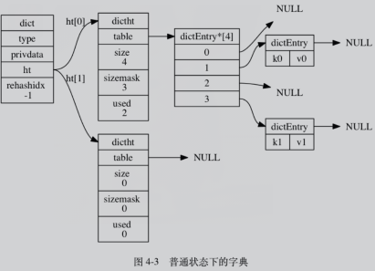
### 涉及类型
- Redis 数据库
- Hash Key：当键值对较多，或元素多为长字符串时。

___
### 数据结构
#### dict, dictType
```C
/* 字典 */
typedef struct dict {

    // 类型特定函数
    dictType *type;

    // 私有数据
    void *privdata;

    // 哈希表
    dictht ht[2];

    // rehash 索引
    // 当 rehash 不在进行时，值为 -1
    int rehashidx; /* rehashing not in progress if rehashidx == -1 */

} dict;
```
- dictType：用于实现多态，其他类型的值操作函数
- privdata：实现多态时特定类型的参数
- ht[2]：使用`ht[0]`为主字典，`ht[1]`仅在 rehash 使用。
- rehashidx：rehash进度，未进行时 =-1

```C
typedef struct dictType {

    // 计算哈希值的函数
    unsigned int (*hashFunction)(const void *key);

    // 复制键的函数
    void *(*keyDup)(void *privdata, const void *key);

    // 复制值的函数
    void *(*valDup)(void *privdata, const void *obj);

    // 对比键的函数
    int (*keyCompare)(void *privdata, const void *key1, const void *key2);

    // 销毁键的函数
    void (*keyDestructor)(void *privdata, void *key);

    // 销毁值的函数
    void (*valDestructor)(void *privdata, void *obj);

} dictType;
```

#### dictht, dictEntry
```c
typedef struct dictht {
    // 哈希表数组
    dictEntry **table;
    // 哈希表大小
    unsigned long size;
    // 哈希表大小掩码，用于计算索引值
    // 总是等于 size - 1
    unsigned long sizemask;
    // 该哈希表已有节点的数量
    unsigned long used;
} dictht;

typedef struct dictEntry {
    // 键
    void *key;
    // 值
    union {
        void *val;
        uint64_t u64;
        int64_t s64;
    } v;
    // 指向下个哈希表节点，形成链表
    struct dictEntry *next;
} dictEntry;
```
- dictEntry->next：连接相同哈希的键值，用于解决哈希冲突（collision）
___
### 哈希算法
- 算法：`MurmurHash2`算法
- \<Index> = hashFunc(key) & sizeMask
___
### 扩展与收缩
满足以下条件时，哈希表通过 `rehash`，进行扩展或收缩：
  `loadFactor (负载因子) = used / size`
  
扩展：
- `负载因子 >= 1`，未执行 `BGSAVE / BGREWRITEAOF` 命令
- `负载因子 >= 5`，正在执行 `BGSAVE / BGREWRITEAOF` 命令
  
收缩：
 - `负载因子 <= 0.1`

空间：
  - 扩容：`2^n >= used * 2`
  - 收缩：`2^n >= used`

___
### rehash
  1. `ht[1]` 扩容/收缩到指定空间
  2. **渐进式 rehash**：在每次操作字典时，rehash 一部分`ht[0]`的元素到`ht[1]`
  3. 每一次rehash，rehashidx + 1，最终 rehashidx = ht[0].used时完成，并重新置 -1
  4. ht[1]置为ht[0]，ht[1]分配空指针。

rehash 过程中的表操作，
****
**删查改**的对象会结合ht[0]、ht[1]同时进行（如要删除的k1已经rehash到 ht[1]，则ht[0]上找不到会继续在ht[1]上找）；  
**新增**只在ht[1]上；

保证了ht[0]空间随着rehash只减不增。

## 跳表
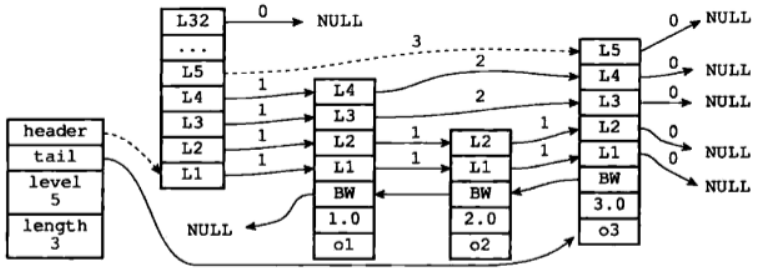
### 涉及类型
- 有序集合 zset（由跳表和字典构成）
___
### 数据结构
```c
// 跳表
typedef struct zskiplist {
    // 表头、表尾节点
    struct zskiplistNode *header, *tail;
    // 跳表长度
    unsigned long length;
    // 当前最大的节点层数
    int level;
} zskiplist;
```
```c
// 跳表节点
typedef struct zskiplistNode {
    // Member，由dict控制唯一
    sds ele;
    // 分数，可不唯一，同分按照ele字典序排序
    double score;
    // 后退指针
    struct zskiplistNode *backward;
    // 层
    struct zskiplistLevel {
        // 前进指针
        struct zskiplistNode *forward;
        // 跨度
        unsigned int span;
    } level[];
} zskiplistNode;
```
- 按照 score，然后 ele **从小到大**排序
- *backward：后退指针，指向**跳表中**上一个节点，以NULL结束。（可以理解为在L1层后退）
- *forward：层前进指针，节点**在该层**的下一个节点，以NULL结束。
- level：保存该节点在各层的指针；层深 `1~32`，越高层概率越小。
- span：该层到下一个节点的距离

## intset
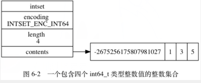
### 涉及类型
 - 整数集
___
### 数据结构
```c
typedef struct intset {
    // 编码方式
    uint32_t encoding;
    // 集合包含的元素数量
    uint32_t length;
    // 保存元素的数组
    int8_t contents[];
} intset;
```
- contents：数据，intset的底层实现，但存放的数据类型依赖于 `encoding`
- encoding：contents 元素的数据类型，取决于最大的元素，枚举有3种：
  - INTSET_ENC_INT16
  - INTSET_ENC_INT32
  - INTSET_ENC_INT64
___
### encoding 升级
当插入比 `encoding` 声明类型更大元素时，contents和encoding会相应升级。  
但升级不可逆，无法降级。

## ziplist 压缩列表
Redis 为了节约内存而开发的，连续内存顺序型（sequential）数据结构。
### 涉及类型
- 列表键：当长度较小，且元素只有**小整形**和**短字符串**。
- 哈希键：当长度较小，且键值对的键值都是**小整形**和**短字符串**。
___
### 数据结构
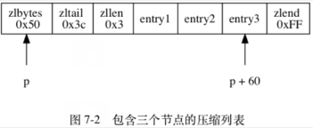
- zlbytes：`4B`，zls的总字节数
- zltail：`4B`，entryTail位置的偏移量，用于 O(1) 定位尾节点
- zllen：`2B`，entry节点个数
- zlend：`1B`，固定值`0xFF`，zls结束标记

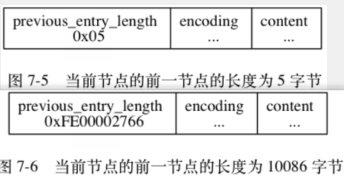
- previours_entry_length：上一个节点的字节数
  - 当 < 254字节，该值长1字节
  - 当 >= 254字节，该值为5字节，第一个字节固定为`0xFE(254)`
- encoding：content 的数据类型声明
___
### prev_entry_length 导致连锁更新
1. prev_entry_length 为 [250, 253]，此时为1字节
2. 发生节点`新增/删除`，导致前节点从`<254`变成`>=254`
3. prev_entry_length 为了存储254以上的长度，变成5字节模式

当多个节点连续满足上述条件，就发生了压缩列表的`连锁更新`。

但这种情况**发生几率不高**，通常不会导致系统性的性能瓶颈。
___
### prev_entry_length 实现zls反向遍历
依靠 `prev_entry_length`，当前节点可以定位到上一个节点，重复即可实现反向遍历。

## redisObject 对象
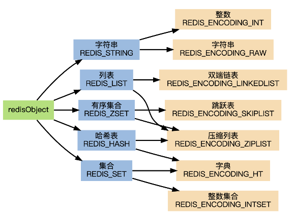
Redis 中的键、和值，分别都是一个对象。
```c
typedef struct redisObject {
    // 类型
    unsigned type:4;
    // 编码
    unsigned encoding:4;
    // 指向底层实现数据结构的指针
    void *ptr;
    // ...
} robj;
``` 
- type：对象类型，包含 Redis 的5种基本类型。
- encoding：对象编码，对应具体使用的底层数据结构，**每种类型至少包含两种以上的编码**。
- ptr：对象实例的指针。

### 作用
1. encoding 使每种类型可以有**不同的数据结构**，优化对象在不同场景下的使用效率。
2. 基于**引用计数**的内存管理，对象间可以自动回收和共享使用内存。
3. 对象实现了**最近访问时间**，可用于 LRU 缓存释放。
___
### 字符串 REDIS_STRING 
#### 编码转换
- int（REDIS_ENCODING_INT）：
  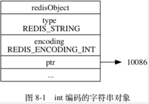
  - 保存 `long` 以下的整数
- embstr（REDIS_ENCODING_EMBSTR）：
  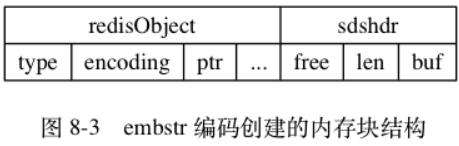
  - 类似于压缩链表，是一次分配的一块连续包含`redisObject`和`sdshdr`的内存
  - `long double` 以下的浮点数
  - 39字节以下的`短字符串`
- raw（REDIS_ENCODING_RAW）：
  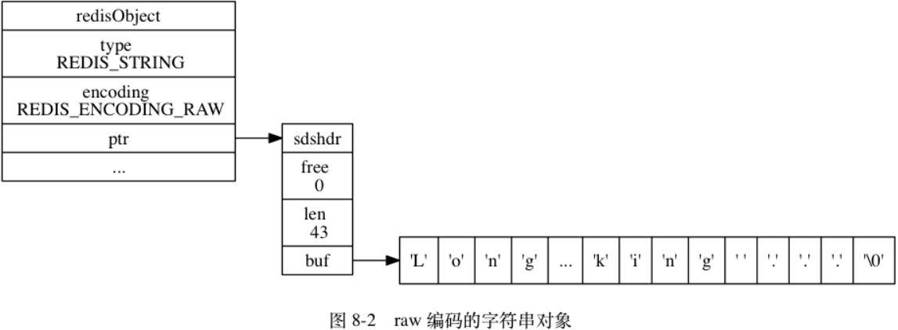
  - 两次内存分配，分别分配`redisObject`和`sdshdr`的内存
  - `长字符串`或`长浮点数`

#### 总结
1. `int`和`embstr`编码类型超过自身能力时可以向上转换`raw`
2. `embstr` 没有操作方法，所以字符串操作过后一定会转换成`raw`
3. `embstr` 相比 `raw`，只需要一次内存分配/释放。
4. 字符串对象是 Redis 五种类型的对象中唯一会被其他四种类型对象嵌套的对象。
___
### 列表 REDIS_LIST
#### 编码
- ziplist
- linkedlist
1. 列表元素 < 64 Bytes
2. 列表长度 < 512
___
### 哈希 REDIS_HASH
#### 编码
- ziplist
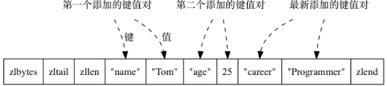
- hashtable
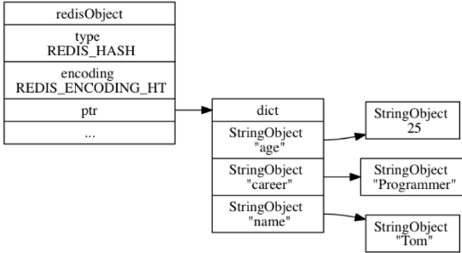

1. key, value 长度 < 64 Bytes
2. 键值对个数 < 512
___
### 集合 REDIS_SET
#### 编码
- intset
- hashtable（值为NULL）
1. 元素都是 int
2. 元素个数 < 512
___
### 有序集合 REDIS_ZSET
#### 编码
- ziplist
  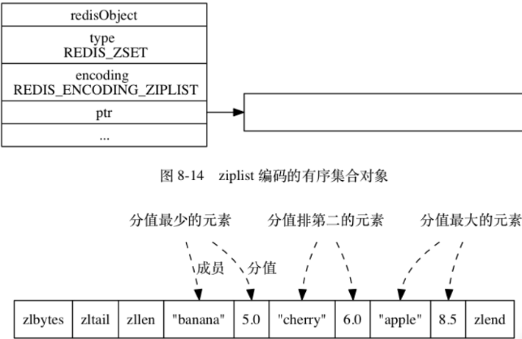
- skiplist （REDIS_ENCODING_SKIPLIST）：
  - zset 结构，由`dict`和`skiplist`组成
  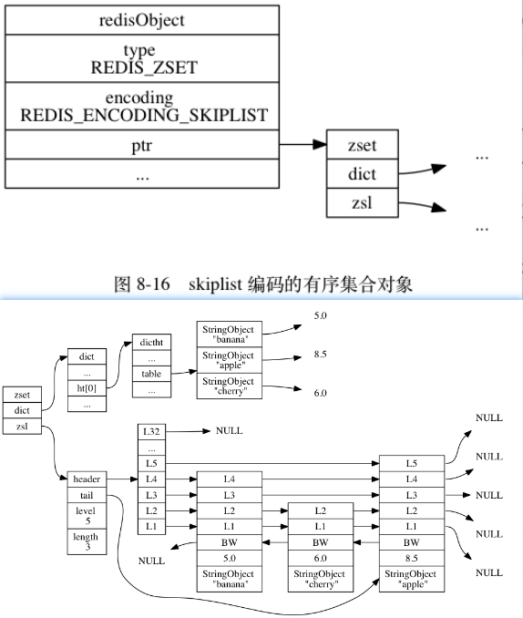

1. 元素大小 < 64 Bytes
2. **元素个数 < 128**

#### zset
```c
typedef struct zset {
    zskiplist *zsl;
    dict *dict;
} zset;
```
- skiplist：按分值从小到大，保存所有元素
- dict：key=item，val=score

#### zset 基于dict和skiplist实现原因
1. skiplist 提供 `ZRANGE, ZRANK` 等范围操作
2. dict 提供 `O(1)` 的查找能力，如 `ZSCORE`

## Redis 多态
- 类型多态：如 `DEL, EXPIRE` 等可以对**多个键**使用的函数
- 编码多态：如 `LLEN` 对列表键的 `ziplist` 和 `linkedlist` 编码都可以使用

## 引用计数
### 对象共享
常见对象 Redis 会进行预分配，而非重复分配空间：
- 各种命令的返回值：`OK, ERROR, WRONGTYPE, QUENED` 等
- `<= REDIS_SHARED_INTEGERS` 的整数：默认为 `[0, 10000]`
___
### 计数归0内存回收
引用计数归0后，会**主动**触发对象的内存回收。  
区别于**过期策略**和**LRU**。

# Redis 数据库
## 数据库键空间

```c
struct redisServer {
  // ...
  // 数据库空间数组，长度为 dbNum，可配置
  redisDb *db;
  int dbNum;

  // ====== RDB 自动保存部分 =======

  // 上次 SAVE/BGSAVE 后，服务器的修改次数
  long long dirty;
  // 上次 SAVE/BGSAVE 的时间戳
  time_t lastsave;

  // 保存修改频次的数组
  struct saveParams {
    time_t seconds;
    int changes;
  }*saveparams;
}
```
```c
struct redisDb {
  // 当前数据库键空间，保存了所有的键值对
  dict *db;
  // 设置了过期时间的键值对，跟db内的对应对象共享引用
  dict *expires;
}
```
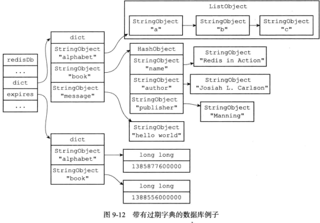
- dict 保存所有键值对
- expires k 设置了过期的键，v 是过期时间戳
- dict 和 expires 的键共享引用

## 过期策略
- 被动：惰性删除  
  在获取键时检查过期时间(expireIfNeeded)，若过期则删除，并返回空回复。
- 主动：定期删除  
  `serverCron` 周期性检查过期字典，随机删除一部分过期键。  
  如 Redis 每秒 10 次：
    1. 测试 20 个带有过期的随机键
    2. 删除找到的所有已过期key
    3. （**继续过期算法**）如果超过 25% 的key已过期，从步骤 1 重新开始

过期键可能长期遗留，导致内存占用，如：过期键长期不使用（不触发惰性删除），且定期删除也漏掉了。

因此需要关联内存阈值的`内存淘汰`策略（LRU, LFU）。

### 过期对 RDB、AOF、复制的影响
- RDB：保存和载入的时候都会判断键的过期时间，已过期的键不会写入 RDB，或者再从 RDB 载入回 Redis。
- AOF：
  - 持久化：每次显式触发`惰性删除`或`定期删除`，会向AOF文件追加对应键的DEL。
  - 重写：类似`RDB`，已过期的键不会重写到新AOF文件。

- 复制：  
  主节点统一控制删除过期，保证一致性。
  - **主节点**上的过期键在触发过期删除后，会向从节点发送 DEL 命令。
  - **从节点**上的过期键，在**主节点** `DEL` 前**仍能正常使用**。 

# Redis 持久化
## RDB 持久化
- SAVE，BGSAVE，可以手动执行或者定期执行。
- RDB 是保存了 Redis 数据的，**已压缩**的**二进制**文件，类似于备份。
- RDB 文件在 Redis 服务启动时自动执行，前提是检测到了 RDB。
- 如果开启了 `AOF 持久化`，则会优先使用 AOF 文件，且 **禁用** RDB 文件还原数据库。

### RDB 自动保存
可以定期设置一段时间内数据库的修改阈值，触发自动保存。
``` sh
# 900s内，进行了至少1次修改，则保存 RDB
save 900 1
# 300s内，进行了至少10次修改，则保存 RDB
save 300 10
```

## AOF 持久化
- **AOF 文件**：以 Redis 网络协议格式保存所有执行过的命令明文。  
```c
struct redisServer {
  // ...
  // AOF 缓冲区
  sds aof_buf;
}
```

### AOF 同步的实现
```python
def eventLoop():
    while True:
        # ...

        # 处理文件事件，接收命令请求以及发送命令回复
        # 处理命令请求时可能会有新内容被追加到 aof_buf 缓冲区中
        processFileEvents()

        # 处理时间事件
        processTimeEvents()

        # 考虑是否要将 aof_buf 中的内容写入和保存到 AOF 文件里面
        flushAppendOnlyFile()
```
1. 每执行完一个命令，都会追加到 `aof_buf` 末尾。
2. 每轮事件循环(`eventLoop`)结束前，`flushAppendOnlyFile` 会将 `aof_buf` 的内容全部写入(`write`) AOF 文件
3. 写入后是否执行 `fsync` 同步，取决于 `appendfsync`:  
  - `always`：总是执行 `fsync`，安全性最高，效率最差。
  - `everysec`：**默认设置**。上次 `fsync`，距今超过1秒则 `sync`。
  - `no`：Redis 不主动调用 `fsync`，由系统自行控制。
___
### appendfsync 效率与安全性
`no` 虽然节省了每次同步时间，但会在系统缓存中积累一定量的数据，导致单次同步时间延长，综合来说效率和 `everysec` 相同，但是安全性落后。
___
### AOF 载入
1. Redis 启动时，创建一个非连接的 `fake client` 假客户端。
2. `fake client` 逐行执行 AOF 文件中的服务器命令，效果等同于在客户端界面上执行。
3. 整个过程服务器状态阻塞，直到 AOF 还原完成。
___
### AOF 重写
基于当前时刻 `Redis 的数据快照`，生成对应的命令，写入新 AOF 文件。

### AOF 后台重写
- fork 子进程基于当前 `Redis数据快照` 进行命令重写。
- 同时主进程会维护一个 `AOF 重写缓冲区`。
- 新的数据写入除了原本的 `AOF 缓冲区 => AOF 文件`，还会同步写入 `AOF 重写缓冲区` 中，作为记录**重写过程中产生的数据变更**。
- 重写完成后，主进程将 `AOF 重写缓冲区` 的数据**发送**到子进程，追加到新 AOF 文件中。
- 追加完成，主进程收到消息，最后一次将 `重写缓冲区` 的数据（可能存在未发送的）追加到新 AOF。
- 执行AOF原子性替换，**新 AOF** 替换 **旧 AOF**。

## MP-AOF (> Redis 7.x)
### AOF 后台重写的局限性
上述 `BGREWRITEAOF` 由于引入了 `aof_rewrite_buf`，会产生一系列 CPU、内存、IO的问题
- CPU：
  1. 主进程写入`aof_rewrite_buf`，并将其中的数据发送给子进程。
  2. 子进程获取主进程发送的数据，需要循环读取 `pipe`。
  3. 最后主进程的收尾工作，如果`重写缓冲区`数据依旧很多，最后一次追加会占用主进程CPU时间。
- 内存：
  1. `aof_buf` 和 `aof_rewrite_buf` 中的数据是重复冗余的，可能导致内存开销过大，甚至触发系统OOM。
- IO：
  1. `aof_buf` 和 `aof_rewrite_buf` 中的冗余数据，最终都会分别追加到`旧AOF`和`新AOF`中，产生双倍IO。
___
### MP-AOF 机制
新的 AOF 文件分为3个部分：
1. BASE：`基础AOF`，最多只有1个，一般通过子进程重写生成。
2. INCR：`增量AOF`，可能存在多个，一般会在重写开始执行时被创建，与`BASE`整体形成完整意义上的`AOF`。
3. HISTORY：每次重写完成，此前的`BASE`和`INCR`转变成`HISTORY`，最终被Redis定时器删除。

此外，使用`manifest`维护、追踪所有的`BASE`、`INCR`。
```c
struct redisServer {
    // ...
    aofManifest *aof_manifest;
}
```
___
### AOF持久化
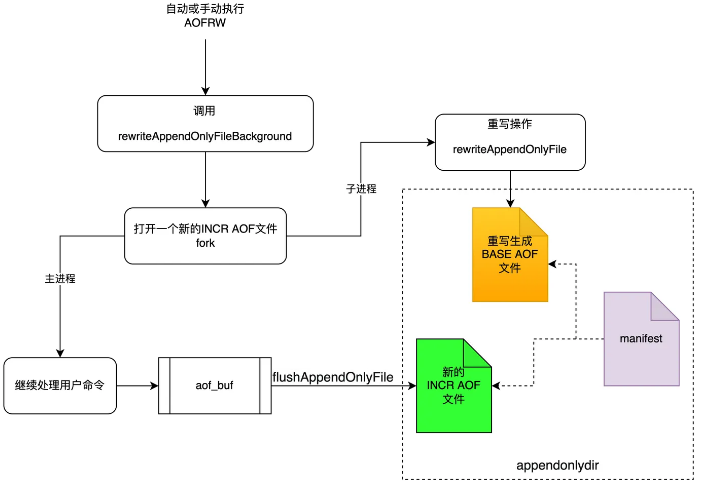
  1. Redis 启动时，创建初始`BASE`, `INCR`。
  2. AOF 缓冲区的内容总是写入最新的 `INCR`。
  3. 开启重写后，生成临时`BASE`和新的`INCR`。
  4. 子进程重写入临时`BASE`。
  5. 期间的脏数据继续写入新`INCR`，无需再写入`aof_rewrite_buf`。
  6. 重写完成后，`新BASE`和`新INCR`代表了此刻Redis的全部数据。
  7. 主进程原子更新`manifest`：
      - 将旧`BASE`和`INCR`标记为`HISTORY`，等待删除。
      - 将`新BASE`和`新INCR`追加进来。