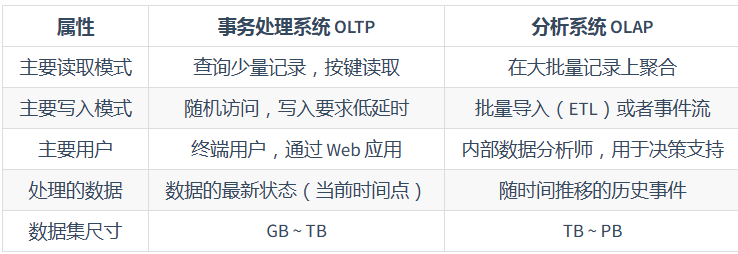

# DDIA
## 第二章
### MapReduce
- 一种批量数据处理框架
- 分为Map（映射）Reduce（归约）两部分
- Map（分解任务）：将任务分解成可以横向扩展计算的小任务，对每一个分片调用`Map方法`
- 分组汇总：将Map任务的结果按照分组依据汇总
- Reduce（归约）：将结果合并处理（如每个节点统计的A对象相加，就是总体的A对象）
- 问题：
  - Map 和 Reduce 必须是纯函数；编写Map和Reduce通常比单个查询更加复杂

## 第三章 存储与检索
- 最简单的 KV 存储使用`get()` `write()` 进行追加写入就可实现
- 需要解决硬盘数据文件上大量数据的快速定位和查找问题
  
### 散列索引
- 保存在**内存**中的KV：`K--键 V--数据的文件偏移量 `
- 追加分段（segment）
- 压缩：合并存量段，删除同一个Key的旧记录

### LSM树（Log Struct Merge）和 SSTables

- 顺序存储Key：散列索引的**基础**上，要求Key在segment内有序
- 定时合并：保证每一个段上Key唯一
- 段倒序查询：查找某个key，在当前段找，否则找最近的一个段，以此类推。
- 问题：
  - 范围查询仅仅是key有序，数据还是在磁盘上的散列值，依旧需要大量IO
  - 无法判断key不存在，需要遍历所有的段（通常加**布隆过滤器**解决）

### B树

- 数据按**页（Page）**存储，每页4KB，是**读写的最小单位**。
- 每页保存几个键值和页指针（页个数为`分支因子branching factor`）

### LSM 和 B树对比
- **事务性**：B树占优。LSM 的键值在不同的段中有副本，对于通过加范围锁实现的事务性来说不适合。
- **写性能：**LSM占优。顺序写入+写入放大小（不需要B树WAL两次写入+可能覆写多个页面）
- **读性能**：B树占优。
- **存储效率：**LSM更紧凑，没有碎片。

### 数仓

- OLTP（在线事务处理，Online Tran Processing）：事务插入，更新等
- OLAP（在线分析处理，Online Tran Processing）：范围查询，汇总、排序等二次处理
- 数仓的必然性：数据库通常不能兼用OLTP和OLAP，OLTP 需要**高可用和低延迟**，大数据量同库的OLAP会彼此影响性能。