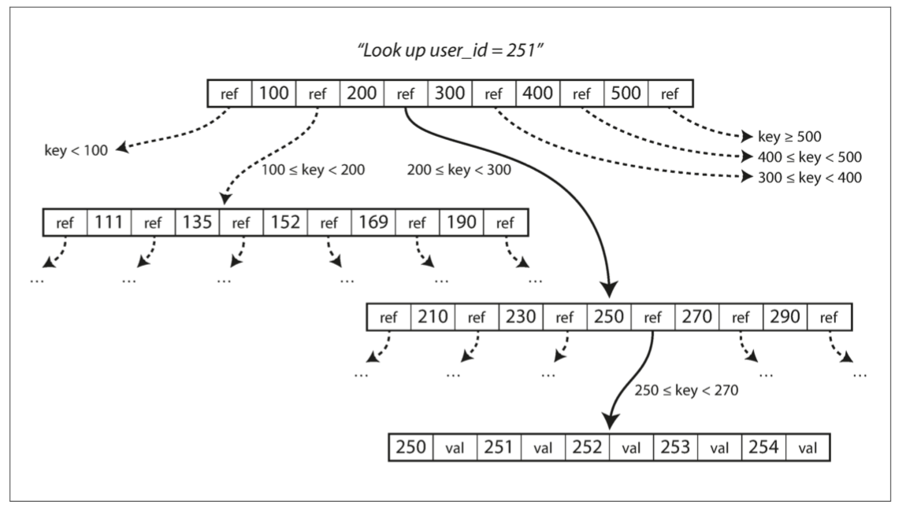

# DDIA
## 第二章
### MapReduce
- 一种批量数据处理框架
- 分为Map（映射）Reduce（归约）两部分
- Map（分解任务）：将任务分解成可以横向扩展计算的小任务，对每一个分片调用`Map方法`
- 分组汇总：将Map任务的结果按照分组依据汇总
- Reduce（归约）：将结果合并处理（如每个节点统计的A对象相加，就是总体的A对象）
- 问题：
  - Map 和 Reduce 必须是纯函数；编写Map和Reduce通常比单个查询更加复杂

## 第三章 存储与检索
- 最简单的 KV 存储使用`get()` `write()` 进行追加写入就可实现
- 需要解决硬盘数据文件上大量数据的快速定位和查找问题
  
### 散列索引
- 保存在**内存**中的KV：`K--键 V--数据的文件偏移量`
- 寻址过程：`内存表中K ==> 文件数据偏移 ==> 文件数据 ==> value`
- 追加分段（segment）
- 压缩：合并存量段，删除同一个Key的旧记录
- **缺点：** 
  - **压缩**：高写入时，频繁压缩可能存在性能波动
  - **内存消耗：** 所有的key都要放进内存

### LSM树（Log Struct Merge）和 SSTables

- 顺序存储Key：散列索引的**基础**上，要求Key在segment内有序
  - 新写入先写在内存表，并且按照key有序且唯一（红黑树或者平衡树实现）
  - 达到一定阈值，flush到文件系统：`key--offset`**追加写入**为新段，`数据`在磁盘offset为止散列存储
  - 后台**定时合并**文件系统中的所有segments
- 优点：
  - 合并高效：因为每个段内数据有序，可以用归并的性质，即使段很多超过了内存容量
  - 相对于散列索引，节省了内存，散列需要所有key加载内存，LSM 可以加载部分索引使用**稀疏索引**的特性
  - 最终落盘是顺序写入，**写入性能高**
- 问题：
  - 范围查询可能需要穿透多层SSTables
  - 穿透场景差：key不存在时需要遍历所有的段（通常加**布隆过滤器**解决）
  - 合并可能导致性能波动

### B树

- 数据按**页（Page）**存储，每页4KB，是**读写的最小单位**。
- 每页保存几个键值和页指针（页个数为`分支因子branching factor`）

### LSM 和 B树/B+树对比
```
考虑3个维度：
1. 性能上：读、写性能
2. 存储效率：空间利用率
3. 应用层面：事务性
```
**LSM（写好读差）：**
- 优点：
  - 写入性能好，支持更高的写入吞吐量：
    - 顺序写入
    - 没有B树WAL产生的每份数据的写入放大
    - 没有B树页分裂时更新多个索引页
  - 空间占用小：
    - 定期压缩可以收缩很小的段
    - 没有索引碎片
- 缺点：
  - 合并可能导致性能波动
  - 多个段副本导致范围锁**事务适应性**差

**B/B+（读好写差）：**
- 优点：
  - 性能稳定
  - 没有LSM段数据副本，读性能好
  - B+树叶子结构范围读性能好
  - 可以支持**事务性**：加范围锁
- 缺点：
  - 存储空间浪费：频繁更新导致索引碎片化，存储空间利用率低

### 数仓

- OLTP（在线事务处理，Online Tran Processing）：事务插入，更新等
- OLAP（在线分析处理，Online Tran Processing）：范围查询，汇总、排序等二次处理
- 数仓的必然性：数据库通常不能兼用OLTP和OLAP，OLTP 需要**高可用和低延迟**，大数据量同库的OLAP会彼此影响性能。